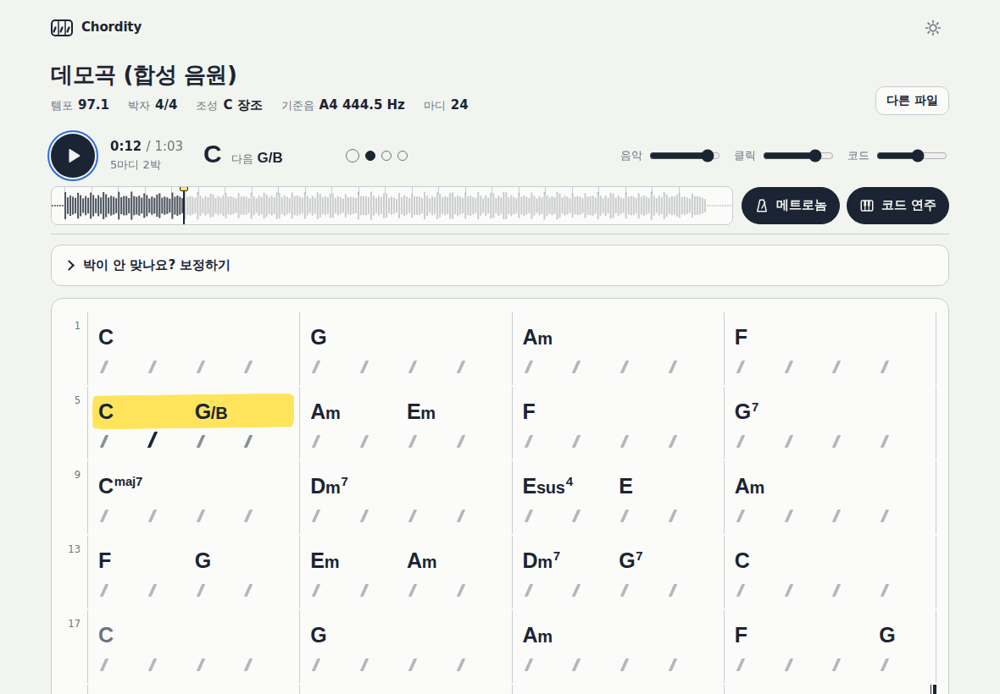
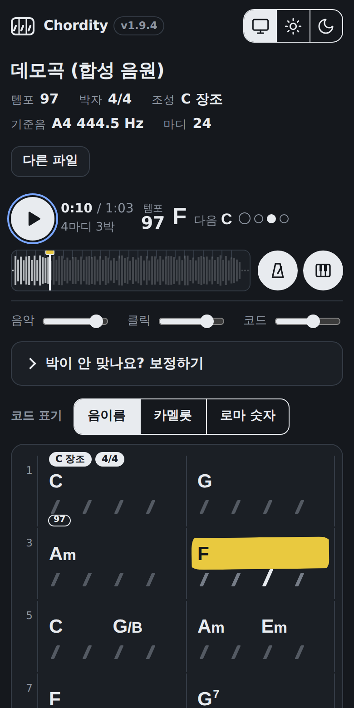
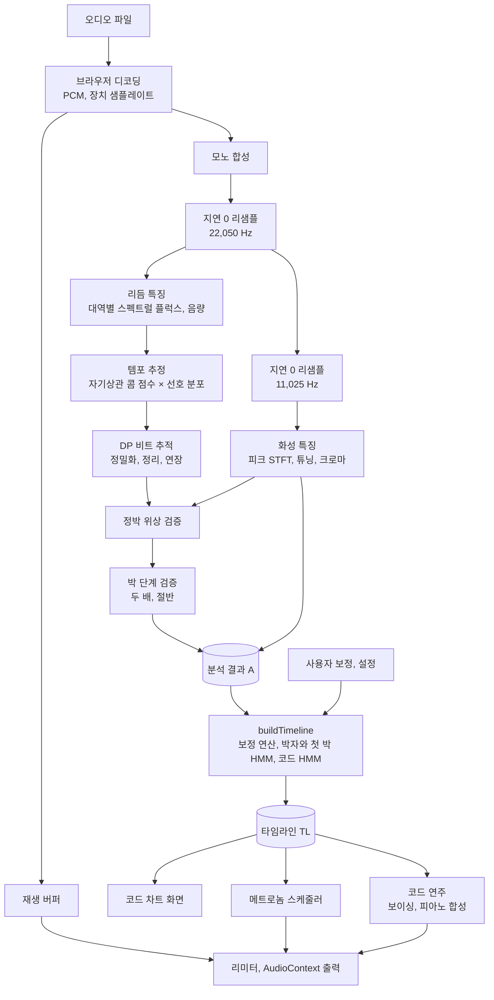
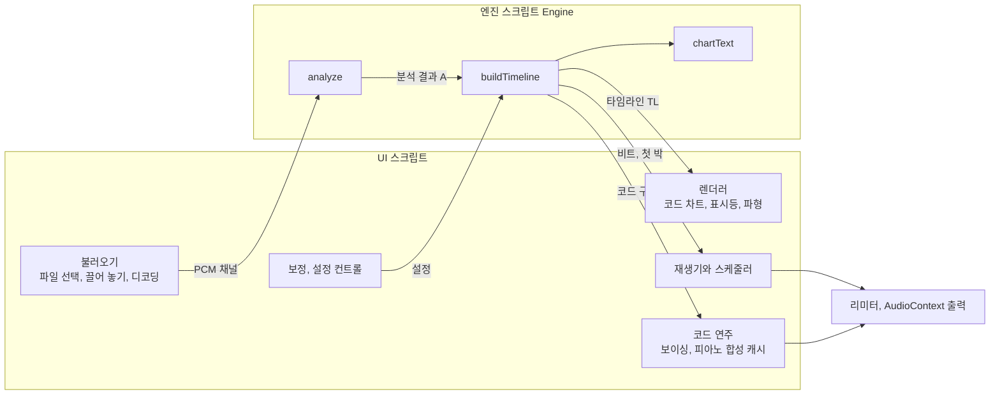
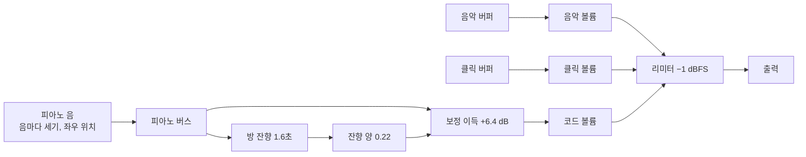

# 마디 코드 (Madi Code)

**노래 파일을 넣으면 마디마다 코드를 적어 주고, 노래의 박에 딱 맞춰 메트로놈을 쳐 주는 웹 페이지입니다.**

코드가 바뀌는 순간에는 피아노가 그 코드를 쳐 줘서, 귀로 확인하며 따라 칠 수 있습니다. 설치도, 회원 가입도, 인터넷 연결도 필요 없습니다. 음악 파일은 내 컴퓨터 밖으로 나가지 않습니다.

*Per-measure chord recognition, a beat-locked metronome and synthesized piano chord playback in a single offline HTML file. No libraries, no uploads.*



<details>
<summary><b>목차</b></summary>

- [1부. 쉽게 알아보기](#1부-쉽게-알아보기)
- [2부. 원리](#2부-원리)
- [3부. 작동 방식](#3부-작동-방식)
- [4부. 깊이 들여다보기](#4부-깊이-들여다보기)
  - [4-1. 알고리즘과 수식](#4-1-알고리즘과-수식)
  - [4-2. 물리 세계](#4-2-물리-세계)
  - [4-3. 체계](#4-3-체계)
  - [4-4. 이슈와 해결](#4-4-이슈와-해결)
  - [4-5. 최적화](#4-5-최적화)
  - [4-6. 검증](#4-6-검증)
  - [4-7. 특장점](#4-7-특장점)
  - [4-8. 한계와 앞으로](#4-8-한계와-앞으로)
  - [4-9. 참고 문헌](#4-9-참고-문헌)

</details>

---

## 1부. 쉽게 알아보기

### 이럴 때 쓰면 좋아요

- 좋아하는 노래를 기타나 피아노로 따라 치고 싶을 때
- 노래의 코드를 알아내야 하는데 귀로 하나하나 찾기 어려울 때
- 원곡에 맞춰 박자 연습을 하고 싶을 때

### 쓰는 법

1. `chord-chart.html` 파일을 크롬, 엣지, 사파리, 파이어폭스 같은 브라우저로 엽니다.
2. **파일 열기**를 누르거나, 음악 파일을 창 위로 끌어다 놓습니다. 몇 초 기다리면 코드 차트가 나타납니다.
3. **재생** 버튼을 누릅니다. 음악과 함께 메트로놈이 박마다 "딱" 하고 울리고, 지금 연주되는 마디에 노란 형광펜이 칠해집니다. 코드가 바뀔 때마다 피아노가 그 코드를 쳐 줍니다.

MP3, WAV, M4A, FLAC, OGG처럼 브라우저가 재생할 수 있는 파일이면 됩니다.

### 화면 읽는 법

| 보이는 것 | 뜻 |
|---|---|
| 노란 형광펜 | 지금 연주되고 있는 마디 |
| 빗금 `/` | 한 박. 진하게 바뀌는 빗금이 지금 박 |
| `C` `Am` `G7` | 코드 이름. 빗금 바로 위에 있으면 그 박에서 코드가 바뀜 |
| `G/B` | G 코드인데 가장 낮은 음이 B |
| 회색 코드 | 앞 마디의 코드가 그대로 이어짐 |
| `N.C.` | 코드가 없는 부분 (드럼만 나오거나 조용할 때) |
| 0번 마디 | 노래가 마디 중간에서 시작하는 부분 (못갖춘마디) |
| 마디 위의 `2박` 같은 표시 | 그 마디만 박 수가 다름 |
| 동그라미 표시등 | 지금 몇 번째 박인지. 가장 큰 동그라미가 마디의 첫 박 |
| 위쪽의 "다음 G" | 곧 나올 코드 |
| 메트로놈, 코드 연주 버튼 | 누를 때마다 켜고 끔 |
| 음악, 클릭, 코드 막대 | 원곡, 메트로놈, 피아노 코드 소리의 크기를 따로 조절 |

### 메트로놈이 이상하게 들리면

대부분 알아서 맞춰지지만, 노래에 따라 사람마다 박을 다르게 세기도 합니다. **박이 안 맞나요? 보정하기**를 열고 아래 버튼을 눌러 보세요. 누르는 즉시 바뀝니다.

| 이렇게 들리면 | 이 버튼을 |
|---|---|
| 클릭이 박과 박 사이에 들린다 | ½박 옮기기 |
| 클릭이 너무 촘촘하다 | 절반으로 ÷2 |
| 클릭이 너무 드문드문하다 | 두 배 빠르게 ×2 |
| 6/8 느낌의 곡인데 클릭이 너무 많다 | 셋씩 묶기 ÷3 |
| 마디가 시작되는 곳이 한 박 어긋났다 | 한 박 앞당기기, 한 박 늦추기 |
| 클릭이 아주 살짝 이르거나 늦게 느껴진다 | 클릭 타이밍 |
| 처음 상태로 돌리고 싶다 | 보정 모두 되돌리기 |

코드를 더 간단하게 보고 싶으면 **코드 표기**에서 "기본"을, 한 박 안에서 바뀌는 코드까지 보고 싶으면 "½박 단위"를 고르세요.

### 피아노로 코드 듣기

**코드 연주**를 켜 두면 코드가 바뀌는 순간 피아노가 그 코드를 쳐 줍니다. 원곡과 겹쳐 들으면 적힌 코드가 맞는지 귀로 바로 확인할 수 있고, 따라 칠 때 길잡이도 됩니다. 피아노는 곡의 음높이에 저절로 맞춰지므로 원곡과 음이 어긋나지 않습니다.

- 음악, 클릭, 코드 소리 크기는 위쪽 막대 세 개로 따로 맞춥니다.
- **보정하기**의 **코드 연주**에서 치는 때를 고를 수 있습니다: 코드가 바뀔 때, 마디마다 다시, 박마다.
- 끄려면 **코드 연주** 버튼이나 P 키를 누르세요.

### 단축키

| 키 | 하는 일 |
|---|---|
| Space | 재생, 일시정지 |
| M | 메트로놈 켜기, 끄기 |
| P | 코드 연주 켜기, 끄기 |
| ← → | 이전 마디, 다음 마디 |
| Home | 처음으로 |

마디를 누르면 그 마디로 가고, 위쪽 파형을 누르거나 끌어도 원하는 곳으로 갑니다. 한글 입력 상태에서도 단축키가 동작합니다.

### 잘 되는 노래, 어려운 노래

드럼이 있는 팝, 록, 발라드, 댄스, 힙합처럼 박이 분명하고 기본 코드 위주인 노래는 잘 됩니다. 재즈처럼 코드가 복잡한 노래, 템포가 자유롭게 늘었다 줄었다 하는 노래, 레게처럼 박을 두 가지로 셀 수 있는 노래는 틀릴 수 있습니다. 이럴 때는 위의 보정 버튼을 쓰세요.

### 알아 두면 좋은 것

- 파일은 인터넷으로 보내지지 않습니다. 모든 분석은 브라우저 안에서 합니다.
- 메트로놈, 코드 연주, 볼륨, 코드 표기 같은 설정은 브라우저에 저장되어 다음에도 그대로입니다.
- 블루투스 이어폰을 써도 음악, 클릭, 피아노가 함께 늦게 나오기 때문에 서로 어긋나지 않습니다.
- 아이폰에서 소리가 안 나면 무음 모드가 켜져 있는지 확인하세요.

<p align="center"></p>

---

## 2부. 원리

이 프로그램은 미리 학습된 인공지능 모델을 쓰지 않습니다. 소리의 물리적 성질과 음악의 규칙을 수식으로 옮긴 **신호 처리**와 **확률 모델**로 동작합니다. 그래서 판단 근거를 하나하나 설명할 수 있고, 화면 아래 **분석 정보**에서 그 근거를 직접 볼 수 있습니다.

### 2-1. 소리를 그림으로 바꾸기

소리는 공기의 떨림이고, 녹음 파일은 그 떨림을 1초에 수만 번 잰 숫자의 나열입니다. 숫자만 봐서는 어떤 음이 울리는지 알기 어렵기 때문에, 소리를 아주 짧은 조각으로 잘라 조각마다 **어떤 높이의 소리가 얼마나 섞여 있는지**(스펙트럼)를 계산합니다. 이것을 시간 순으로 늘어놓으면 가로가 시간, 세로가 음높이인 소리의 그림(스펙트로그램)이 됩니다. 이후의 분석은 모두 이 그림을 읽는 일입니다.

여기에는 피할 수 없는 맞바꿈이 있습니다. 조각을 짧게 자르면 **언제** 소리가 났는지는 정확하지만 **무슨 음**인지는 흐려지고, 길게 자르면 그 반대입니다. 그래서 박을 찾을 때는 짧은 조각을, 코드를 찾을 때는 긴 조각을 따로 씁니다. 가장 낮은 베이스 음은 반음 사이의 주파수 차이가 아주 작아서 가장 긴 조각이 필요합니다.

### 2-2. 박 찾기: 새로 울리는 순간들의 규칙

드럼을 치거나 건반을 누르면 그 순간 소리 에너지가 갑자기 늘어납니다. 이런 순간을 **온셋**이라고 합니다. 스펙트로그램에서 직전보다 커진 부분만 더하면 온셋마다 뾰족하게 솟는 곡선이 생깁니다.

박은 이 온셋들이 **일정한 간격으로 반복되는 뼈대**입니다. 먼저 곡선을 시간 방향으로 밀어 가며 자기 자신과 겹쳐 보고(자기상관), 가장 잘 겹치는 간격, 즉 템포를 찾습니다. 그다음 "강한 온셋은 최대한 많이 지나가면서 간격은 템포에서 크게 벗어나지 않는" 박의 줄을 곡 전체에 걸쳐 한 번에 찾습니다(동적 계획법). 박을 하나씩 따로 정하지 않고 전체를 한꺼번에 최적화하기 때문에 약한 박이 몇 개 섞여 있어도 줄이 끊기지 않고, 연주 템포가 조금씩 흔들려도 따라갑니다. 이때 "일정한 간격"의 기준은 곡 전체의 템포가 아니라 몇 초 단위로 구한 **국소 템포**입니다. 그래서 필인처럼 잠깐 리듬이 복잡해지는 곳에는 끌려가지 않으면서, 곡이 실제로 느려지거나 빨라지면 따라갑니다.

### 2-3. 진짜 박인지 확인하기

규칙적인 줄을 찾았다고 끝이 아닙니다. 흔한 실수가 두 가지 있습니다.

**엇박을 박으로 잡는 경우.** 하이햇이 박 사이를 강하게 채우면 줄이 반 박 밀려 잡힐 수 있습니다. 그런데 음악에는 규칙이 있습니다. 킥, 스네어, 베이스가 들어오는 순간과 코드가 바뀌는 순간은 대부분 **정박**에 몰립니다. 그래서 찾은 박 위치와 반 박 옮긴 위치에서 이런 사건들의 세기를 비교하고, 반 박 옮긴 쪽이 분명히 강하면 줄 전체를 반 박 옮깁니다.

**템포를 두 배나 절반으로 잡는 경우.** 느린 발라드에 8분음표 아르페지오가 촘촘하면 8분음표 하나하나를 박으로 착각하기 쉽습니다. 이때는 박을 하나씩 걸러 두 무리로 나눠 봅니다. 진짜 박에는 킥과 스네어가 오고 사이에는 건반 소리만 있다면, 한 무리가 다른 무리보다 훨씬 강하게 나옵니다. 그러면 약한 무리를 버리고 템포를 절반으로 고칩니다. 반대로 박 사이 한가운데마다 스네어가 규칙적으로 오면 템포를 너무 느리게 잡은 것이므로 두 배로 고칩니다. 두 배로 늘리는 쪽은 틀리면 곧바로 엇박 클릭이 생기므로 훨씬 엄격한 조건에서만 합니다.

실제 녹음에서는 하이햇과 건반이 엇박을 채워서 두 무리의 세기 차이가 작게 나올 수 있습니다. 그래서 **킥과 스네어가 어느 무리에 오는지**도 봅니다. 제 템포라면 킥(1·3박)과 스네어(2·4박)가 서로 다른 무리에 오고, 두 배로 잡혔다면 둘 다 같은 무리(진짜 박)에 옵니다. 템포를 절반으로 고칠 때는 비트를 하나씩 걸러 내지 않고 새 템포로 처음부터 다시 추적합니다. 8분음표 단계의 추적이 곡 중간 어딘가에서 한 칸만 미끄러져도, 걸러 낸 비트는 그 뒤로 전부 반 박씩 어긋나기 때문입니다.

"스네어"를 알아보는 방법이 물리적입니다. 스네어 밑면의 줄이 떨리면 중간 높이부터 아주 높은 소리까지 **한꺼번에** 커지는 잡음이 납니다. 건반의 음은 몇몇 높이에서만 커지고, 하이햇은 높은 쪽에서만 커집니다. 그래서 "중간 높이와 높은 쪽이 동시에 커졌는가"를 두 값의 곱으로 재면 스네어만 골라낼 수 있습니다. 둘 중 하나라도 작으면 곱이 작아지기 때문입니다.

### 2-4. 마디 나누기

박을 몇 개씩 묶어 마디를 만들려면 **마디의 첫 박**이 어디인지 알아야 합니다. 첫 박에는 흔적이 남습니다. 코드가 바뀌고, 베이스 음이 바뀌고, 킥이 세게 들어가고, 소리가 커지기도 합니다. 박마다 이런 흔적에 점수를 매기고, "마디는 보통 같은 길이로 반복된다"는 규칙을 지키면서 점수가 가장 높은 묶음을 찾습니다. 4박과 3박 가운데 어느 쪽이 흔적과 더 잘 맞는지도 이 방법으로 정합니다. 한 박 안이 셋으로 쪼개지는 느낌이 강하면 6/8, 12/8 같은 겹박자로 봅니다.

### 2-5. 코드 알아내기

옥타브가 다른 같은 음(낮은 도와 높은 도)은 화음에서 같은 역할을 합니다. 그래서 모든 음을 도, 도♯, 레 … 시의 **12칸**으로 접어 넣으면, 그 순간 울리는 음들의 지문이 생깁니다(크로마). C 코드라면 도, 미, 솔 칸이 두드러집니다.

실제 악기는 한 음만 내지 않습니다. 도를 치면 한 옥타브 위의 도, 그 위의 솔, 다시 도, 미 … 같은 **배음**이 함께 울립니다. 예를 들어 C 코드의 미에서 나온 배음은 시 칸을 채워서, 배음을 모르는 비교로는 C를 Cmaj7으로 착각합니다. 그래서 코드의 지문도 배음까지 포함해 만들어 두고 비교합니다.

베이스(가장 낮은 음)는 따로 봅니다. 코드는 C인데 베이스가 미라면 `C/E`로 적습니다.

녹음마다 기준음이 조금씩 다릅니다. A음이 정확히 440 Hz가 아닌 곡도 많습니다. 그래서 곡 전체의 음들이 평균적으로 얼마나 높거나 낮은지 먼저 재고, 그만큼 보정한 다음 12칸에 넣습니다.

### 2-6. 음악의 규칙을 확률로

박마다 가장 비슷한 코드를 고르기만 하면 멜로디의 지나가는 음 때문에 코드가 박마다 깜빡이듯 바뀝니다. 그래서 두 가지 상식을 확률로 넣습니다. **코드는 자주 바뀌지 않는다**, 그리고 **바뀐다면 마디 첫 박에서 가장 잘 바뀌고 박 사이에서는 잘 안 바뀐다**. 이 규칙과 소리가 얼마나 비슷한지를 함께 따져, 곡 전체에서 가장 그럴듯한 코드 순서를 한 번에 고릅니다(은닉 마르코프 모델과 비터비 알고리즘). 곡의 조성도 추정해서, 조성에 어울리는 코드에 약간의 가산점을 줍니다.

### 2-7. 어긋나지 않는 메트로놈

이 메트로놈은 "1분에 97번 똑딱"처럼 일정한 간격으로 치지 않고, **찾아낸 박 하나하나의 시각**에 칩니다. 그래서 연주가 조금 빨라지거나 느려져도 따라갑니다.

타이밍도 정밀합니다. 타이머로 "지금 쳐!" 하고 클릭을 내면 컴퓨터가 바쁠 때 수십 ms씩 늦어집니다. 그래서 음악을 재생하는 **오디오 장치의 시계**에 클릭을 0.2초 앞서 예약해 둡니다. 음악과 클릭이 같은 시계와 같은 출력 경로를 쓰므로 샘플 하나 단위로 맞물리고, 출력이 늦는 장치에서도 둘이 함께 늦게 나와 서로는 어긋나지 않습니다.

### 2-8. 코드를 피아노로 들려주기

녹음된 피아노 소리를 넣으면 파일이 커지고 외부 파일이 필요해집니다. 그래서 피아노 소리를 **물리 법칙으로 직접 만들어** 씁니다. 피아노 현은 이상적인 줄이 아니라 뻣뻣한 강철선이어서, 배음이 정확한 정수배보다 조금씩 높게 울립니다(비조화성). 해머는 현 길이의 1/7쯤 되는 곳을 때리기 때문에, 그 지점에서 움직이지 않는 배음은 약하게 울립니다. 한 음을 두세 가닥의 현이 함께 내는데, 현끼리 음이 아주 미세하게 달라 소리가 천천히 일렁이고(맥놀이), 처음엔 빨리 줄다가 나중엔 오래 남는 두 단계 감쇠가 생깁니다. 높은 배음일수록 빨리 사라져 소리가 점점 부드러워집니다. 이 성질들을 수식으로 쌓아 한 음씩 합성합니다.

코드는 왼손 베이스 한 음과 오른손 화음으로 나눠 칩니다. 오른손은 앞 코드에서 손이 가장 적게 움직이는 자리바꿈을 골라, 코드가 바뀌어도 소리가 들쭉날쭉하지 않습니다. 피아노는 분석에서 찾은 곡의 기준음에 맞춰 조율되고, 메트로놈과 같은 오디오 시계에 예약되어 코드가 바뀌는 순간에 정확히 울립니다.

---

## 3부. 작동 방식

### 3-1. 전체 흐름



분석은 **무거운 단계**와 **가벼운 단계**로 나뉩니다.

- **무거운 단계** `analyze()` 는 파일을 열 때 한 번만 실행됩니다. 신호 처리 전부와 자동 비트 추적까지 합니다. 보통 몇 초 걸리며, 32 ms마다 화면에 제어권을 넘겨 진행률 표시가 멈추지 않습니다.
- **가벼운 단계** `buildTimeline()` 은 보정 버튼이나 설정을 바꿀 때마다 실행됩니다. 박자, 마디, 코드를 다시 계산하는데 5분짜리 곡도 약 40 ms라서 누르는 즉시 반영됩니다.

### 3-2. 불러오기와 전처리

1. 브라우저 내장 디코더가 파일을 PCM으로 풉니다. 이 버퍼 하나를 **재생과 분석에 함께** 씁니다. 따로 디코딩하거나 브라우저의 리샘플러를 거치면 두 결과의 시간축이 수 ms씩 어긋날 수 있기 때문입니다.
2. 채널을 평균해 모노로 만들고, 직접 구현한 리샘플러로 22,050 Hz(리듬용)와 11,025 Hz(화성용) 신호를 만듭니다. 필터 커널이 좌우 대칭이라 신호가 한 샘플도 밀리지 않습니다.
3. 최대 진폭을 1로 맞춥니다.

### 3-3. 리듬 특징

| 단계 | 하는 일 | 주요 값 |
|---|---|---|
| 단시간 푸리에 변환 | 22,050 Hz 신호를 조각마다 스펙트럼으로 | 창 1024점(46.4 ms), 홉 256점(11.6 ms, 초당 86.13 프레임) |
| 로그 압축 | 조용한 소리의 변화도 드러나게 | log(1 + 1000·\|X\|) |
| 최대값 필터 | 두 프레임 전 스펙트럼을 주파수 방향 ±1칸으로 넓혀 비교 | 비브라토, 음정 미끄러짐을 온셋으로 착각하지 않음 |
| 대역별 플럭스 | 커진 양만 대역별로 평균 | 저역 21–200 Hz(킥, 베이스), 중역 200–2,500 Hz(스네어 몸통, 건반), 고역 2.5–10 kHz(하이햇, 스네어 줄) |
| 온셋 포락선 | 대역마다 표준편차로 나눠 합산 | 고역은 절반 가중(엇박 하이햇의 영향 축소) |
| 음량 | 프레임별 RMS | 소리 구간 판정과 파형 표시에 사용 |

### 3-4. 화성 특징

| 단계 | 하는 일 | 주요 값 |
|---|---|---|
| 트레블 피크 STFT | 코드 구성음용 스펙트럼 피크 | 창 2048점(186 ms), 110–4,200 Hz, 프레임당 최대 36개 |
| 베이스 피크 STFT | 베이스 음과 튜닝용 | 창 4096점(372 ms), 32–1,400 Hz, 프레임당 최대 24개 |
| 피크 조건 | 뚜렷한 봉우리만 | 프레임 최댓값 대비 −45 dB 이상, 주변 ±6칸 평균의 2배 이상 |
| 로그 포물선 보간 | 주파수와 크기를 칸 간격보다 정밀하게 | 피크와 양옆 칸의 로그 크기 사용 |
| 기준음 추정 | 모든 피크의 "반음 소수부"를 원 위에서 평균 | 예: +18 cent → A4 = 444.6 Hz |
| 크로마 | 보정한 음높이를 12칸에 누적 | 반음 중심에 가까울수록 큰 가중치(cos²). 트레블은 MIDI 48–96, 베이스는 28–57 |
| 화성 변화 곡선 | 앞뒤 4프레임 크로마의 코사인 거리 | 정박 위상 검증에 사용 |

### 3-5. 템포와 비트

1. **소리 구간**: 곡의 큰 음량(상위 5%) 대비 −38 dB 이상인 구간을 소리로 봅니다.
2. **템포**: 온셋 곡선을 ±3초 평균 음량으로 나눠 평준화하고 자기상관을 구합니다. 40–240 BPM을 0.25 BPM 간격으로 훑으며 1·2·3·4배 간격을 함께 보는 콤 점수에 110 BPM 중심의 선호 분포를 곱하고, 최댓값 주변을 포물선 보간합니다.
3. **DP 비트 추적**: Ellis(2007)의 방법을 두 가지 바꿔 씁니다. 간격은 8초 창으로 구한 국소 템포 곡선(필인을 거르도록 7초 중앙값)과 비교하고, 벌점 강도는 박 주기의 제곱에 비례하게 두어 느린 곡에서도 같은 ms만큼의 흔들림에 같은 벌점을 줍니다.
4. **정밀화**: 각 비트를 ±2프레임(±23 ms) 안의 온셋 정점으로 옮기고 포물선 보간합니다. 온셋이 약한 비트는 이웃 비트들의 직선 회귀로 채웁니다. 마지막으로 검출 지연 6.5 ms를 보정합니다.
5. **정리**: 소리 구간 밖의 비트를 지우고, 앞뒤로 같은 간격을 이어 붙여 소리 구간 전체를 덮습니다.
6. **검증**: 정박 위상 검증과 박 단계 검증을 차례로 합니다(2-3의 원리). 박 단계를 절반으로 고치면 새 템포로 3~5를 다시 하고 위상도 다시 검증합니다.

### 3-6. 박자, 마디, 코드 (가벼운 단계)

1. **보정 연산 적용**: 사용자가 누른 ½박, ×2, ÷2, ÷3을 누른 순서대로 비트 목록에 적용합니다. ÷2와 ÷3은 어느 박을 남길지 박 강세로 정합니다.
2. **박 단위 집계**: 박 구간의 크로마를 가운데에 가중치를 두어 평균합니다. 베이스 크로마에서는 곡 전체 중앙값의 절반을 빼서, 음정이 있는 킥 드럼처럼 늘 깔린 성분을 없앱니다.
3. **조성**: Krumhansl–Kessler 조성 프로필과 상관이 가장 높은 조를 고릅니다.
4. **예비 코드**: 장3화음과 단3화음만으로 빠르게 한 번 풀어 첫 박 증거로 씁니다.
5. **세분 판정**: 박 안의 1/2 지점과 1/3, 2/3 지점의 온셋 세기를 비교해 겹박자인지 봅니다.
6. **첫 박 HMM**: 박자를 자동으로 고르고(4박 대 3박, 겹박자면 4 대 2), 사용자의 첫 박 이동을 반영합니다.
7. **최종 코드 HMM**: 1박 또는 ½박 단위로, 전위를 포함해 최대 289개 상태에서 비터비로 풉니다.
8. **마디 구성**: 첫 박마다 마디를 나누고, 마디 안의 코드 변화 위치와 길이, 앞 마디에서 이어지는지 여부, 조성에 맞는 음이름(♯ 또는 ♭)을 붙입니다.

### 3-7. 재생과 메트로놈

- **음악**: `AudioBufferSourceNode` 를 현재 오디오 시각보다 60 ms 뒤에 시작합니다.
- **스케줄러**: 25 ms마다 깨어나 앞으로 0.2초 안에 올 비트의 클릭을 오디오 시계에 예약합니다. 탭이 백그라운드에 있으면 브라우저가 타이머를 늦추므로 1.5초 앞까지 예약합니다.
- **클릭 소리**: 미리 만들어 둔 짧은 소리입니다(첫 박 1,850 Hz, 나머지 1,250 Hz). 첫 샘플부터 소리가 나서 발음 지연이 없습니다.
- **재동기화**: 위치를 옮기거나 보정, 설정을 바꾸면 예약된 클릭을 모두 취소하고 현재 위치 다음 비트부터 다시 예약합니다.
- **화면**: 매 프레임 재생 위치를 계산하되, 브라우저가 알려 주는 출력 지연만큼 빼서 실제로 들리는 시점에 맞춥니다. 마디, 박, 코드가 바뀔 때만 화면을 고칩니다.

### 3-8. 보정 버튼이 하는 일

| 버튼 | 내부 연산 | 동작 |
|---|---|---|
| ½박 옮기기 | `half` | 이웃 비트의 중간점으로 새 비트 목록을 만들고 온셋 정점에 다시 맞춤. 음악 시작 전으로 삐져나온 박은 버림 |
| 두 배 빠르게 ×2 | `x2` | 비트 사이마다 중간점을 추가 |
| 절반으로 ÷2, 셋씩 묶기 ÷3 | `d2`, `d3` | 2개(3개)마다 하나를 남김. 남길 위치는 박 강세 합이 큰 쪽 |
| 한 박 앞당기기, 늦추기 | `downShift` ∓1 | 마디 안 위치 번호를 한 칸씩 회전 |
| 박자 | `meter` | 첫 박 HMM을 지정한 박 수로 다시 풂 |

보정은 비트 목록에 대한 **연산 기록**으로 저장되어 매번 처음부터 순서대로 다시 적용됩니다. 되돌리기는 이 기록을 비우는 것입니다.

### 3-9. 코드 연주

| 단계 | 하는 일 |
|---|---|
| 코드 구간 | 엔진이 마디의 코드 이벤트마다 구성음(0 = C)과 연주할 베이스 음을 함께 넘깁니다. 슬래시 표기를 끄면 베이스는 근음입니다. |
| 타건 목록 | 치는 때에 따라 만듭니다. "코드가 바뀔 때"는 마디를 넘어 이어지는 같은 코드를 한 번만, "마디마다 다시"는 마디 첫 박에서 다시, "박마다"는 모든 박에서 칩니다. N.C.에서는 치지 않고 앞 코드도 멈춥니다. |
| 보이싱 | 베이스는 D2~C♯3, 오른손은 구성음 전부를 밀집 배치로 두되 이전 배치의 중심과 가장 가까운 자리바꿈을 고릅니다. |
| 합성과 캐시 | 곡에 쓰이는 음을 처음 나오는 순서대로 한 음씩 미리 합성해 둡니다(음마다 한 번). 곡의 기준음이 바뀌면 다시 만듭니다. |
| 예약 | 메트로놈과 같은 스케줄러가 0.2초 앞의 타건을 오디오 시계에 예약합니다. 클릭 타이밍 보정은 적용하지 않고 음악 시각 그대로 칩니다. |
| 소리 끝 | 코드 구간이 끝나는 시각(다음 타건이나 N.C.)에 댐퍼가 내려오듯 70 ms 시간 상수로 줄어듭니다. |
| 재시작 | 코드 중간에서 재생하거나 이동하면 진행 중인 코드를 곧바로 한 번 울립니다. |
| 믹싱 | 음악, 클릭, 코드 볼륨이 각각 따로 있고, 피아노에는 1.6초짜리 방 잔향을 조금 섞은 뒤 고정 보정 이득(+6.4 dB)을 줍니다. 세 소리는 출력 직전 리미터(−1 dBFS)를 지나 클리핑 없이 합쳐집니다. |

메트로놈과 코드 연주는 재동기화도 따로 합니다. 메트로놈을 끄고 켜거나 클릭 타이밍을 바꿔도 울리고 있는 피아노 코드는 끊기지 않습니다.

---

## 4부. 깊이 들여다보기

### 4-1. 알고리즘과 수식

**기호**

| 기호 | 뜻 |
|---|---|
| $F = 22050/256 \approx 86.13$ | 리듬 프레임률(프레임/초) |
| $X(t,k)$ | 프레임 $t$, 주파수 칸 $k$ 의 STFT 값 |
| $\tau$ | 박 주기(프레임 단위) |
| $b_i$ | $i$ 번째 비트 시각(초) |
| $m$ | MIDI 음번호(실수), 마디당 박 수와 문맥으로 구분 |

#### (1) 지연 0 리샘플링

출력/입력 샘플레이트 비를 최대공약수로 약분해 $L/D = f_\text{out}/f_\text{in}$ 로 두면, $n$ 번째 출력 샘플의 입력 위치는 $nD/L = i_n + \phi_n$ 입니다( $i_n$ 정수부, $\phi_n$ 소수부).

```math
y[n] = \sum_{j=0}^{2W-1} x[\,i_n - W + 1 + j\,]\; h(\phi_n + W - 1 - j)
```

```math
h(u) = 2f_c\,\operatorname{sinc}(2f_c u)\,w\!\left(\frac{u}{W+1}\right),\qquad
w(r) = 0.42 + 0.5\cos\pi r + 0.08\cos 2\pi r
```

```math
f_c = 0.46\,\min\!\left(1, \frac{f_\text{out}}{f_\text{in}}\right),\qquad W = \left\lceil \frac{10}{2f_c} \right\rceil
```

$h$ 가 우함수(좌우 대칭)이므로 위상이 0, 즉 지연이 0입니다. 위상 $\phi_n$ 은 최대 4,096단계 테이블로 미리 계산하고, 입력 위치는 정수 누산기( $D = qL + r$ )로 갱신해 부동소수점 오차가 쌓이지 않습니다.

#### (2) 실수 FFT

$N$ 점 실수 신호를 $N/2$ 점 복소 FFT 한 번으로 계산합니다. $z[m] = x[2m] + i\,x[2m+1]$, $Z = \mathrm{FFT}_{N/2}(z)$ 라 하면

```math
X[k] = \underbrace{\tfrac12\left(Z[k] + \overline{Z[N/2-k]}\right)}_{F_e[k]}
     + e^{-2\pi i k/N}\,\underbrace{\tfrac{-i}{2}\left(Z[k] - \overline{Z[N/2-k]}\right)}_{F_o[k]},\qquad 0 \le k \le N/2
```

$Z$ 의 인덱스는 $N/2$ 주기로 봅니다( $Z[N/2] = Z[0]$ ).

#### (3) 대역별 스펙트럴 플럭스와 온셋 포락선

```math
Y(t,k) = \ln\!\left(1 + \lambda \cdot \tfrac{4}{N}\,|X(t,k)|\right),\qquad \lambda = 1000
```

```math
\Delta(t,k) = \max\!\Big(0,\; Y(t,k) - \max_{|\nu|\le 1} Y(t-2,\,k+\nu)\Big)
```

```math
f_b(t-1) = \frac{1}{|B_b|}\sum_{k \in B_b} \Delta(t,k),\qquad b \in \{\text{low}, \text{mid}, \text{high}\}
```

비교하는 두 프레임( $t$, $t-2$ )의 가운데인 $t-1$ 에 기록합니다. 비트 추적용 온셋 포락선은 다음과 같습니다.

```math
O(t) = \frac{f_\text{low}(t)}{\sigma_\text{low}} + \frac{f_\text{mid}(t)}{\sigma_\text{mid}} + \frac12\,\frac{f_\text{high}(t)}{\sigma_\text{high}}
```

#### (4) 템포 추정

±3초 창의 음량으로 평준화하고 평균을 뺍니다.

```math
E(t) = \frac{O(t)}{\sqrt{\frac{1}{|W_t|}\sum_{s \in W_t} O(s)^2} + \epsilon} - \bar E,\qquad W_t = [\,t - 3F,\ t + 3F\,]
```

자기상관은 겹치는 길이로 나누고 $r(0)$ 으로 정규화한 뒤 $[\tfrac14, \tfrac12, \tfrac14]$ 로 평활해 $\tilde r$ 로 씁니다.

```math
r(\ell) = \frac{1}{n-\ell}\sum_{t=0}^{n-\ell-1} E(t)\,E(t+\ell)
```

BPM 후보 $v$ 마다 박 주기 $\tau_v = 60F/v$ 의 1~4배 지연을 함께 봅니다.

```math
J(v) = \pi(v)\cdot\max\!\Big(0,\ \sum_{k=1}^{4} c_k \max_{|\delta| \le \delta_k} \tilde r(k\tau_v + \delta)\Big),\qquad c = \left(1, \tfrac12, 0.33, \tfrac14\right)
```

```math
\pi(v) = \exp\!\left(-\frac12 \log_2^2 \frac{v}{110}\right),\qquad
\delta_1 = 0.5,\quad \delta_{k\ge 2} = 0.5 + 0.004\,k\tau_v
```

$v \in [40, 240]$ 을 0.25 간격으로 훑고, 최댓값에서 세 점 포물선 보간으로 소수점 BPM을 얻습니다.

#### (5) DP 비트 추적 (Ellis, 2007)

온셋을 폭 $\sigma = \tau/32$ 의 가우스로 평활한 국소 점수와 누적 점수는 다음과 같습니다.

```math
\ell(t) = \frac{1}{\sigma_O}\sum_{i} O(t+i)\,e^{-\frac12\left(\frac{32 i}{\tau}\right)^2}
```

```math
C(t) = \ell(t) + \max_{\tau(t)/2 \,\le\, d \,\le\, 2\tau(t)}\Big[\,C(t-d) - \alpha \ln^2\frac{d}{\tau(t)}\,\Big],\qquad \alpha = \operatorname{clip}\!\left(2000\,T^2,\ 100,\ 1600\right)
```

$T = \tau/F$ 는 박 주기(초)입니다. $\alpha\ln^2(d/\tau) \approx 2000\,(\Delta t)^2$ ( $\Delta t$ 는 간격이 어긋난 초)이므로 벌점이 템포와 상관없이 **절대 시간** 기준이 됩니다. 원래 방법의 고정값 100은 퍼센트 기준이라, 느린 곡에서는 같은 퍼센트가 훨씬 긴 ms가 되어 박이 싱코페이션에 끌려갔습니다.

국소 박 주기 $\tau(t)$ 는 8초 창(1초 간격)의 자기상관 $r_w$ 로 구하고, 7개 창의 중앙값으로 필인 같은 순간적 흔들림을 거른 뒤 프레임마다 선형 보간합니다.

```math
\tau_w = \arg\max_{\ell \in [0.85\tau,\ 1.15\tau]} \Big( r_w(\ell) + \tfrac12\, r_w(2\ell) \Big),\qquad
\tau(t) = \operatorname{clip}\!\Big(\operatorname{interp}_t\big(\operatorname{median}_{7}\,\tau_w\big),\ 0.85\tau,\ 1.15\tau\Big)
```

역추적 시작점은 $C$ 의 국소 최댓값 가운데 그 중앙값의 절반을 넘는 마지막 지점입니다. 경로의 앞뒤에서 평활한 국소 점수가 전체 RMS의 절반에 못 미치는 비트는 잘라 냅니다.

#### (6) 비트 정밀화

$\pm 2$ 프레임 안의 온셋 최댓값 $j$ 에서 포물선 보간합니다.

```math
\hat t = j + \frac12\cdot\frac{O(j-1) - O(j+1)}{O(j-1) - 2O(j) + O(j+1)},\qquad b = \frac{\hat t}{F} + t_\text{cal},\quad t_\text{cal} = 6.5\ \text{ms}
```

세기가 중앙값의 0.35배 미만인 비트는 좌우 4개 이웃을 가중치 $1/(1+|j-i|)$ 로 선형 회귀해 위치를 정합니다. 소리 구간이 $[t_s, t_e]$, 박 간격이 $p$ 일 때 비트는 $[\,t_s - p/4,\ t_e + p/4\,]$ 안으로 자르고, 앞쪽은 $b_0 - p \ge \max(0, t_s - p/4)$ 인 동안, 뒤쪽은 $b_\text{last} + p \le t_e - p/2$ 인 동안 같은 간격으로 이어 붙입니다.

#### (7) 정박 위상 검증

화성 변화 곡선 $\nu$ 는 제곱근 압축 후 L2 정규화한 크로마 $\hat c$ 로 만듭니다.

```math
\nu(t) = \left(1 - \cos\!\Big(\sum_{d=0}^{3}\hat c_{t+d},\ \sum_{d=1}^{4}\hat c_{t-d}\Big)\right)\cdot \min\!\left(1, \sqrt{\frac{\min(e_t, e_{t-1})}{e_{70\%}}}\right)
```

박 강세 곡선은 소리 구간 평균 $\mu$ 로 정규화한 네 곡선의 가중합입니다.

```math
S(t) = 1.0\,\frac{f_\text{low}}{\mu_\text{low}} + 0.7\,\frac{f_\text{mid}}{\mu_\text{mid}} + 0.2\,\frac{f_\text{high}}{\mu_\text{high}} + 0.8\,\frac{\nu}{\mu_\nu}
```

```math
\text{on} = \frac1N\sum_i \max_{|\delta|\le 2} S(b_i + \delta),\qquad
\text{off} = \frac1N\sum_i \max_{|\delta|\le 2} S\!\left(\tfrac{b_i + b_{i+1}}{2} + \delta\right)
```

$\text{off} > 1.1\cdot\text{on}$ 이면 비트 전체를 반 박 옮깁니다(비트 8개 이상일 때).

#### (8) 박 단계 검증

킥 곡선 $K$ 와 스네어 곡선 $S_n$ 을 정의합니다. $S_n$ 은 중역과 고역의 기하평균이라 **두 대역이 동시에 오를 때만** 커집니다.

```math
K(t) = \frac{f_\text{low}(t)}{\sigma_\text{low}},\qquad
S_n(t) = \sqrt{\frac{f_\text{mid}(t)}{\sigma_\text{mid}}\cdot\frac{f_\text{high}(t)}{\sigma_\text{high}}}
```

비트마다 $p_i = K + S_n + \tfrac12 S$ (±2프레임 최댓값)를 구해 짝수 번째와 홀수 번째 평균의 비를 봅니다.

```math
r_2 = \frac{\max(\bar p_\text{even}, \bar p_\text{odd})}{\min(\bar p_\text{even}, \bar p_\text{odd})}
```

| 교정 | 조건 | 동작 |
|---|---|---|
| 절반으로 | ( $r_2 \ge 2.4$ 또는 같은 쪽 치우침) 이고 BPM ≥ 110, BPM/2 ≥ 55 | 박 주기 $2\tau$ 로 처음부터 다시 추적 |
| 두 배로 | BPM ≤ 100, 2·BPM ≤ 210, $\sum S_n(\text{mid}) / \sum S_n(\text{beat}) \ge 1.3$, $\sum K(\text{beat}) / \sum K(\text{mid}) \ge 2$ (mid는 비트 사이 중간점) | 중간점을 추가하고 온셋에 맞춤 |

**같은 쪽 치우침**은 짝·홀 비트에서 킥이 강한 쪽을 +로 두고 잰 치우침입니다.

```math
s_X = \operatorname{sgn}(K_\text{even} - K_\text{odd})\cdot\frac{X_\text{even} - X_\text{odd}}{X_\text{even} + X_\text{odd}},\qquad
\text{same side} \iff s_K \ge 0.15\ \land\ s_{S_n} \ge 0.15\ \land\ s_\nu > 0\ \land\ r_2 \ge 1.3
```

제 박에서는 백비트 때문에 스네어가 킥의 반대쪽에 오므로 $s_{S_n} < 0$ (합성 곡 −0.28 ~ −0.61)이고, 두 배로 잡힌 경우에는 둘 다 진짜 박 쪽에 오므로 $s_{S_n} > 0$ 입니다.

두 배 교정이 훨씬 엄격한 까닭은 위험이 비대칭이기 때문입니다. 잘못 절반으로 줄이면 클릭이 성겨질 뿐이지만, 잘못 두 배로 늘리면 추가된 클릭 전부가 엇박이 됩니다.

#### (9) 박 세분 판정

비트 구간을 24등분한 위상마다 온셋 최댓값을 평균한 프로필 $P(\varphi)$ 에서

```math
\text{triple} \iff \min\!\big(P(\tfrac13), P(\tfrac23)\big) > 1.15\,P(\tfrac12)\ \ \land\ \ \tfrac12\big(P(\tfrac13) + P(\tfrac23)\big) > 1.1\,\operatorname{median}(P)
```

#### (10) 스펙트럼 피크, 튜닝, 크로마

로그 크기 $L_-, L_0, L_+ = \ln|X(k-1)|, \ln|X(k)|, \ln|X(k+1)|$ 로

```math
\delta = \frac12\cdot\frac{L_- - L_+}{L_- - 2L_0 + L_+},\qquad
\hat f = (k + \delta)\frac{f_s}{N},\qquad
\hat A = \frac{4}{N}\exp\!\left(L_0 - \tfrac14(L_- - L_+)\,\delta\right),\qquad
m = 69 + 12\log_2\frac{\hat f}{440}
```

기준음 편차(반음 단위)는 소수부 $d_j = m_j - \operatorname{round}(m_j)$ 의 원형 평균입니다(베이스 STFT의 MIDI 40–90 피크, 가중치 $\sqrt{A_j}$ ).

```math
\theta = \frac{1}{2\pi}\operatorname{atan2}\!\Big(\sum_j \sqrt{A_j}\sin 2\pi d_j,\ \sum_j \sqrt{A_j}\cos 2\pi d_j\Big),\qquad
A4 = 440 \cdot 2^{\theta/12}\ \text{Hz}
```

보정한 음높이 $\tilde m = m - \theta$ 로 크로마를 쌓습니다. $w(\cdot)$ 는 트레블과 베이스 각각의 음역 창입니다.

```math
C(t, q) = \sum_{j:\ \operatorname{round}(\tilde m_j) \bmod 12 = q} A_j\, w(\tilde m_j)\, \cos^2\!\big(\pi(\tilde m_j - \operatorname{round}(\tilde m_j))\big)
```

#### (11) 박 동기 집계, 베이스 바닥, 조성

박 구간 $[t_0, t_1)$ 의 프레임을 가운데 가중으로 평균합니다.

```math
\bar C(q) = \frac{\sum_j \omega_j\,C(j, q)}{\sum_j \omega_j},\qquad \omega_j = 0.1 + \sin(\pi u_j),\quad u_j = \frac{j h - t_0}{t_1 - t_0}
```

베이스 크로마의 상시 성분 제거와 조성 추정은 다음과 같습니다. $\mathbf{K}_\text{mode}$ 는 Krumhansl–Kessler 장조, 단조 프로필이고 $\mathrm{rot}_t$ 는 으뜸음 $t$ 로의 회전입니다.

```math
B'_s(q) = \max\!\Big(0,\ B_s(q) - \tfrac12\operatorname{median}_i B_i(q)\Big)
```

```math
(\hat t, \widehat{\text{mode}}) = \arg\max_{t,\ \text{mode}}\ \operatorname{corr}\!\big(\mathbf{h},\ \mathrm{rot}_t(\mathbf{K}_\text{mode})\big),\qquad
h_q = \sum_i \sqrt{\frac{T_i(q)}{\sum_{q'} T_i(q')}} + \frac12\sqrt{\frac{B_i(q)}{\sum_{q'} B_i(q')}}
```

#### (12) 코드 템플릿과 방출 점수

배음 오프셋 $d = (0, 12, 19, 24, 28, 31)$ 반음, 가중치 $0.6^{h-1}$ 로 구성음과 베이스 누설( $\rho = 0.25$ )을 더합니다.

```math
\tilde T(q) = \sum_{p \in \text{chord}}\ \sum_{h=1}^{6} 0.6^{h-1}\,[\,q \equiv p + d_h\,] \;+\; \rho\sum_{h=1}^{6} 0.6^{h-1}\,[\,q \equiv p_\text{bass} + d_h\,]\pmod{12}
```

```math
T = \frac{(\tilde T/\max\tilde T)^{\gamma}}{\left\|(\tilde T/\max\tilde T)^{\gamma}\right\|_2},\qquad \gamma = 0.45
```

관측 $o_s$ 도 트레블 크로마를 같은 방식(최댓값 정규화, $\gamma$ 제곱, L2 정규화)으로 만듭니다. 코드 $c$ 의 방출 점수는 다음과 같습니다.

```math
e_s(c) = \beta\,\langle o_s, T_c\rangle + \pi_q + \pi_\text{inv} + \kappa\,\mathbf{1}[\,c \subset \text{key}\,]
+ \eta\,g_s\Big(\ln\big(0.06 + \hat b_s(p_\text{bass})\big) - \ln\big(0.06 + \tfrac{1}{12}\big)\Big)
```

$\beta = 30$, $\kappa = 0.6$, $\eta = 1.5$ 이고, $\hat b_s$ 는 합이 1인 베이스 크로마, $g_s = \min\!\big(1, E^\text{bass}_s / (0.5\,E^\text{bass}_{60\%})\big)$ 는 베이스가 약할 때 베이스 항을 줄이는 계수입니다. 코드 없음(N)의 점수는 크로마가 평평할수록, 소리가 작을수록 커집니다.

```math
e_s(\mathrm{N}) = \beta\left(\frac{1}{\sqrt{12}}\sum_q o_s(q) - 0.12\right) + Q_s,\qquad
Q_s = \begin{cases} 12 & r_s < 0.02 \\ 6\,(0.08 - r_s)/0.06 & r_s < 0.08 \\ 0 & \text{otherwise}\end{cases}
```

$r_s$ 는 슬롯의 트레블 에너지를 전체 60백분위수로 나눈 값입니다. 사전 점수 $\pi_q$ 와 전위 사전 점수 $\pi_\text{inv}$ 는 아래와 같습니다.

| 성질 | maj | min | 7 | maj7 | m7 | sus4 | sus2 | dim | aug | m7♭5 | dim7 |
|---|---|---|---|---|---|---|---|---|---|---|---|
| $\pi_q$ | 0 | 0 | −0.4 | −0.6 | −0.4 | −1.2 | −1.4 | −1.3 | −1.8 | −1.2 | −1.6 |

| 베이스 | 근음 | 3음 | 5음 | 7음 |
|---|---|---|---|---|
| $\pi_\text{inv}$ | 0 | −0.7 | −1.0 | −1.0 |

전위는 maj, min, 7, maj7, m7에만 둡니다. 어휘별 상태 수는 기본 73개, 표준 241개, 확장 289개(N 포함)입니다.

#### (13) 코드 비터비: O(T·K)

전이 점수가 "유지 0, 바꾸면 $-\lambda_s$ (도착 코드와 무관)"이므로 매 단계의 최댓값 하나만으로 모든 도착 상태의 최선 전이를 구할 수 있습니다.

```math
V_s(c) = e_s(c) + \max\!\Big(V_{s-1}(c),\ \max_{c'} V_{s-1}(c') - \lambda_s\Big)
```

| 슬롯 위치 | 마디 첫 박 | 짝수 박자의 가운데 박 | 그 밖의 박 | 박 사이(½박 해상도) | 예비 코드(모든 박) |
|---|---|---|---|---|---|
| $\lambda_s$ | 1.5 | 3.0 | 4.0 | 6.0 | 3.0 |

#### (14) 첫 박 증거와 박자 HMM

박 $i$ 의 여섯 특징을 각각 표준화( $Z$ )해 더합니다.

```math
z_i = 1.0\,Z(h)_i + 1.0\,Z(l)_i + 0.5\,Z(g)_i + 0.6\,Z(k)_i + 0.3\,Z(e)_i + 0.4\,Z(o)_i
```

| 기호 | 특징 |
|---|---|
| $h_i$ | 트레블 크로마 변화 $1 - \langle \hat t_i, \hat t_{i-1}\rangle$ |
| $l_i$ | 예비 코드가 바뀌었는가 |
| $g_i$ | 베이스 크로마 변화 |
| $k_i$ | 박 위치의 저역 온셋 세기 |
| $e_i$ | 음량 증가량(dB, 양수만) |
| $o_i$ | 으뜸화음으로 새로 진입했는가 |

상태는 마디 안 위치 $p \in \{0, \dots, m-1\}$ 입니다. 방출 점수는 $p = 0$ 에서 $1.5\,z_i$, 짝수 박자( $m \ge 4$ )의 $p = m/2$ 에서 $0.45\,z_i$, 나머지는 0입니다.

```math
P(p \to p+1) = 1 - 2\varepsilon,\qquad P(k \to 0) = \varepsilon\ \ (1 \le k \le m-2),\qquad P(m-1 \to m-1) = \varepsilon,\qquad \varepsilon = 3\times 10^{-4}
```

작은 확률의 마디 단축과 연장을 허용해 변박이나 잘린 마디에도 경로가 무너지지 않습니다. 박자 자동 선택은 대비도 $\Delta_m$ (첫 박으로 고른 박의 $z$ 평균 − 나머지 박의 $z$ 평균)로 합니다. 후보는 4박과 3박(겹박자면 4와 2)이고, 4박보다 대비도가 0.25(겹박자 0.3) 이상 높을 때만 다른 쪽을 고릅니다.

#### (15) 메트로놈 스케줄링

오디오 시계에서 음악을 $t_s$ 에 곡 위치 $o_s$ 부터 재생하기 시작했다면, 사용자 보정 $\delta$ 를 더한 $i$ 번째 클릭의 예약 시각과 현재 재생 위치, 화면 표시 위치는 다음과 같습니다.

```math
t^\text{click}_i = t_s + (b_i + \delta - o_s),\qquad
\text{pos} = o_s + \max(0,\ t_\text{now} - t_s),\qquad
\text{pos}_\text{display} = \text{pos} - L_\text{out}
```

스케줄러는 주기 $T_\text{tick} = 25$ ms로 깨어나 $b_i + \delta \le \text{pos} + H$ 인 클릭을 예약합니다( $H = 0.2$ s, 백그라운드 탭은 1.5 s). $H \gg T_\text{tick}$ 이므로 타이머가 한 번에 약 175 ms 이상 늦지 않는 한 클릭은 이미 예약되어 있습니다. 클릭 소리는 다음 파형을 미리 계산해 둔 버퍼입니다(첫 박 $f$ = 1,850 Hz, 나머지 1,250 Hz, 앞 2 ms에 선형 감쇠 잡음을 더함).

```math
x(t) = A\Big[\,0.75\,\big(\sin 2\pi f t + 0.3\sin 2\pi (2.02 f) t\big)\,e^{-t/16\,\text{ms}}\Big]
```

#### (16) 피아노 합성

MIDI 음 $m$ 과 곡의 기준음 편차 $\theta$ (반음)로 기본 주파수와 비조화 배음을 정합니다.

```math
f_0 = 440 \cdot 2^{(m - 69 + \theta)/12},\qquad f_k = k f_0\sqrt{1 + B k^2},\qquad B = 3.5\times 10^{-4}\cdot 2^{(m-60)/24}
```

해머 타격 위치 $x_h = 1/7.5$ 와 해머 펠트의 고역 감쇠로 배음 크기를 정합니다.

```math
a_k = \frac{|\sin(\pi k x_h)|}{k^{0.8}}\cdot\frac{1}{1 + (f_k/f_b)^2},\qquad f_b = \operatorname{clip}\big(2600 + 40(m-60),\ 1800,\ 5000\big)\ \text{Hz}
```

각 배음은 빠른 감쇠(즉음)와 느린 감쇠(여음)의 합이고, 낮은 배음은 여러 현 $s$ 가 조금씩 다른 음정 $d_s$ 로 함께 울립니다.

```math
y(t) = \sum_{k}\ \sum_{s=1}^{S_k} \frac{a_k}{S_k}\left(0.60\,e^{-t/\tau^{F}_k} + 0.40\,e^{-t/\tau^{S}_k}\right)\sin\!\left(2\pi f_k\, 2^{d_s/1200}\, t + \varphi_k\right)
```

```math
\tau^{S}_k = \max\!\left(0.12,\ \tau_1\Big(\frac{f_0}{f_k}\Big)^{0.7}\right),\qquad \tau^{F}_k = 0.15\,\tau^{S}_k,\qquad \tau_1 = \operatorname{clip}\!\left(8.5\cdot 2^{-(m-38)/16},\ 1.0,\ 8.5\right)\ \text{s}
```

현의 수 $S_k$ 는 $k \le 6$ 에서 1(m < 35), 2(m < 47), 3(그 밖)이고 $k > 6$ 은 1입니다. 현별 조율 차는 $d = (0, +1.0, -0.8)$ cent입니다. 배음은 32번째, 8 kHz까지만 쓰고 −100 dB 아래로 내려간 뒤는 계산하지 않습니다. 시작 위상 $\varphi_k$ 는 음마다 고정된 난수로 배음마다 다르게 두되, 같은 배음의 여러 현은 같은 위상으로 출발시킵니다(4-2의 맥놀이 참고). 여기에 30 ms 해머 잡음, 2 ms 어택 램프, 끝 60 ms 페이드를 더하고, 앞 0.3초의 RMS가 0.12가 되도록 맞춥니다. 길이는 $\operatorname{clip}(5.6 - 0.07(m-38),\ 2.6,\ 5.6)$ 초입니다. 피아노 경로 전체에는 고정 보정 이득 +6.4 dB(×2.09)를 곱합니다. 사인은 `Math.sin` 대신 회전 재귀로 만들고 2,048 샘플마다 크기를 1로 되돌립니다.

```math
\begin{pmatrix} c_{i+1} \\ s_{i+1} \end{pmatrix} =
\begin{pmatrix} \cos\omega & -\sin\omega \\ \sin\omega & \cos\omega \end{pmatrix}
\begin{pmatrix} c_i \\ s_i \end{pmatrix},\qquad \omega = \frac{2\pi f}{f_s}
```

#### (17) 보이싱과 타건

오른손 후보는 구성음의 자리바꿈마다 맨 아래 음을 F3~E4(53~64)에 두고 위로 쌓은 밀집 배치입니다.

```math
n_\text{bass} = 38 + \big((p_\text{bass} - 38) \bmod 12\big),\qquad
\hat V = \arg\min_{V}\ \big|\bar V - \mu\big| + 2\max(0,\ V_\text{top} - 77),\qquad
\mu \leftarrow 0.7\,\bar{\hat V} + 0.3\cdot 62
```

$\bar V$ 는 배치의 평균 음높이이고, $\mu$ 는 D4(62)에서 시작해 직전 배치를 따라가되 가운데로 조금씩 당겨집니다. 세기는 베이스 0.62, 오른손 음마다 $0.5\sqrt{3/n}$ ( $n$ 은 오른손 음 수), 좌우 위치는 $\operatorname{clip}((m-60)/36,\ -0.5,\ 0.5)$ 입니다. 타건 시각 $t_j$ 는 (15)와 같은 방식으로 오디오 시계에 옮기되 사용자 클릭 보정 $\delta$ 는 더하지 않고, 코드 구간이 끝나는 시각 $t^\text{end}_j$ 부터 음량을 시간 상수 70 ms로 줄입니다.

```math
t^\text{piano}_j = t_s + (t_j - o_s),\qquad g(t) = g_0\,e^{-(t - t^\text{end}_j)/70\,\text{ms}}\quad (t \ge t^\text{end}_j)
```

### 4-2. 물리 세계

#### 소리, 음높이, 평균율

소리는 공기 압력의 떨림이고, 음높이는 떨림의 주파수입니다. 12평균율은 한 옥타브(주파수 2배)를 12개의 같은 비로 나눕니다.

```math
f(m) = 440 \cdot 2^{(m - 69)/12}\ \text{Hz},\qquad
m(f) = 69 + 12\log_2\frac{f}{440},\qquad
\text{cent}(f_1, f_2) = 1200\log_2\frac{f_1}{f_2}
```

옥타브가 주파수 2배라는 사실이 음들을 12칸(크로마)으로 접는 근거입니다. 녹음의 기준음은 오래된 녹음의 테이프 속도, 악기 조율, 의도적인 튜닝 때문에 440 Hz에서 벗어나곤 합니다. 예를 들어 +18 cent면 $440 \cdot 2^{0.18/12} \approx 444.6$ Hz입니다.

#### 배음

현이나 관의 진동은 기본 주파수 $f_0$ 의 정수배 $h f_0$ 성분(배음)을 함께 냅니다. 배음이 기본음으로부터 떨어진 거리는 $12\log_2 h$ 반음입니다.

| 배음 $h$ | 반음 거리 | 가장 가까운 평균율 | 차이 | 템플릿 가중치 |
|---|---|---|---|---|
| 1 | 0 | 0 (같은 음) | 0 cent | 1 |
| 2 | 12.00 | 12 (옥타브) | 0 cent | 0.6 |
| 3 | 19.02 | 19 (옥타브 위 5도) | +2.0 cent | 0.36 |
| 4 | 24.00 | 24 (두 옥타브) | 0 cent | 0.216 |
| 5 | 27.86 | 28 (두 옥타브 위 장3도) | −13.7 cent | 0.13 |
| 6 | 31.02 | 31 (두 옥타브 위 5도) | +2.0 cent | 0.078 |
| 7 | 33.69 | 34 | −31.2 cent | 쓰지 않음 |

7번 배음은 평균율에서 31 cent나 벗어나 다른 음 칸에 잘못 들어가므로 템플릿에서 뺐습니다. 배음을 모델에 넣는 효과는 큽니다. C 장3화음(C, E, G)만 쳐도 E의 3배음은 B, G의 3배음은 D가 되어, 배음을 무시하면 Cmaj7이나 Cadd9처럼 보입니다. 단3화음 Cm에서는 C의 5배음이 E(장3도)를 만들어 장조 쪽으로 기울어 보입니다. 템플릿이 이 성분까지 품고 있어야 비교가 공정해집니다.

#### 악기별 주파수 대역

| 소리 | 주요 대역 | 물리적 특징 | 분석에서의 쓰임 |
|---|---|---|---|
| 킥 드럼 | 약 40–100 Hz | 짧은 저음 붐, 음높이가 빠르게 내려감 | 저역 플럭스 → 박, 첫 박 증거 |
| 베이스 | 약 41 Hz(E1)–400 Hz | 정수배 배음, 긴 지속 | 베이스 크로마 → 전위(슬래시 코드) |
| 스네어 | 몸통 약 150–250 Hz, 줄 잡음 약 2–10 kHz | 넓은 대역에 걸친 잡음 | 중역과 고역의 동시 상승 → 백비트 |
| 하이햇 | 약 5–15 kHz | 금속성 잡음 | 고역 플럭스(박 판정에선 가중치를 낮춤) |
| 피아노, 기타, 보컬 | 기본음 약 80 Hz–1 kHz, 배음 수 kHz | 정수배 배음 | 트레블 크로마 → 코드 |

#### 시간과 주파수의 맞바꿈

창 길이 $T$ 의 주파수 분해능은 대략 $1/T$ 이고, 이론적 하한은 $\Delta t\,\Delta f \ge 1/(4\pi)$ 입니다(가우스 창에서 등호). 반면 반음 간격은 주파수에 비례합니다.

```math
\Delta f_\text{semitone}(f) = f\,(2^{1/12} - 1) \approx 0.0595\,f
```

베이스 최저음 E1(41.2 Hz)에서 반음 간격은 2.45 Hz뿐이라, 구분하려면 $T \gtrsim 1/2.45 \approx 0.41$ 초가 필요합니다. A2(110 Hz)에서는 6.5 Hz, A4(440 Hz)에서는 26.2 Hz로 넉넉해집니다. 그래서 용도마다 창을 따로 씁니다.

| 용도 | 샘플레이트 | 창 | 창 길이 | 홉 | 칸 간격 |
|---|---|---|---|---|---|
| 리듬(온셋) | 22,050 Hz | 1024 | 46.4 ms | 11.6 ms | 21.5 Hz |
| 트레블(코드) | 11,025 Hz | 2048 | 185.8 ms | 23.2 ms | 5.38 Hz |
| 베이스, 튜닝 | 11,025 Hz | 4096 | 371.5 ms | 46.4 ms | 2.69 Hz |

베이스 창은 0.41초에 조금 못 미치지만, 한 번에 울리는 베이스 음은 보통 하나이므로 봉우리 위치를 로그 포물선 보간으로 칸 간격보다 훨씬 정밀하게 추정해 보완합니다.

#### 샘플링과 앨리어싱

샘플레이트 $f_s$ 로는 $f_s/2$ (나이퀴스트 주파수)보다 높은 성분을 담을 수 없고, 그대로 줄이면 높은 성분이 낮은 주파수로 접혀 들어옵니다(앨리어싱). 그래서 리샘플러는 새 나이퀴스트의 92%에서 자르는 저역 필터를 겸합니다. 22,050 Hz 신호는 약 10.1 kHz까지 남아 하이햇 대역(2.5–10 kHz)을 담고, 11,025 Hz 신호는 약 5.07 kHz까지 남아 트레블 피크 범위(4.2 kHz까지)를 담습니다. 필요한 정보가 이 아래에 있으므로, 샘플 수를 줄여 계산량을 크게 낮출 수 있습니다.

#### 음량, 잔향, 로그

- 사람의 음량 감각은 대략 로그적이라(베버–페히너 법칙) 데시벨 $L = 20\log_{10}(A/A_\text{ref})$ 로 다룹니다. 소리 구간은 큰 부분 대비 −38 dB 이상으로 정했습니다.
- 스펙트럼을 $\ln(1 + \lambda|X|)$ 로 압축하면 절대 크기보다 **상대 변화**가 드러나, 조용한 기타 스트로크와 큰 킥이 모두 온셋으로 잡힙니다.
- 음이 멈춘 뒤에도 방의 잔향 때문에 에너지가 수백 ms 동안 줄어들며 남습니다. 플럭스는 **증가분만** 더하므로(반파 정류) 잔향의 감쇠는 가짜 온셋을 만들지 않습니다. 곡 끝의 잔향 꼬리에는 박을 무리하게 이어 붙이지 않습니다.

#### 사람의 지각

- **선호 템포**: 사람들이 편하게 박을 세는 템포는 대략 120 BPM 안팎에 몰린다고 알려져 있습니다(Moelants, 2002). 이 프로그램은 느린 발라드를 고려해 중심을 조금 낮춘 110 BPM, 한 옥타브 폭의 선호 분포를 씁니다.
- **박 층위의 모호성**: 음악에는 8분음표, 4분음표, 2분음표 층위의 주기가 물리적으로 모두 존재합니다. 어느 층위를 "박"으로 느끼는지는 지각의 문제라 정답이 하나가 아닐 수 있습니다. 보정 버튼이 있는 이유입니다.
- **타이밍 민감도**: 숙련된 연주자는 수 ms에서 수십 ms의 어긋남도 알아차린다고 알려져 있습니다. 목표 오차를 ±10 ms 안으로 두었고, 실측 평균 오차는 1 ms 안팎입니다(4-6).

#### 피아노 현

코드 연주의 피아노 합성이 흉내 내는 물리 현상입니다.

| 현상 | 물리 | 합성에서 |
|---|---|---|
| 비조화성 | 강철 현의 굽힘 강성 때문에 높은 배음일수록 정수배보다 높아짐. $B = \pi^3 E d^4 / (64 T L^2)$ ( $E$ 영률, $d$ 지름, $T$ 장력, $L$ 길이) | $f_k = k f_0\sqrt{1 + Bk^2}$, 높은 음역일수록 $B$ 증가 |
| 타격 위치 | 해머가 현 길이의 약 1/7~1/9 지점을 때리면, 그 지점이 마디(움직이지 않는 점)인 배음은 거의 울리지 않음 | $\lvert\sin(\pi k x_h)\rvert$ , $x_h = 1/7.5$ |
| 해머 펠트 | 부드러운 펠트가 짧게 닿아 아주 높은 성분을 걸러 냄 | $1/(1 + (f_k/f_b)^2)$ |
| 이중 감쇠 | 한 음의 여러 현이 브리지를 통해 에너지를 주고받아, 처음엔 빨리 줄고 나중엔 오래 남음 | 즉음 60%, 여음 40% |
| 맥놀이 | 한 음의 현들이 1 cent 안팎으로 조금씩 다르게 조율되어 소리가 천천히 일렁임 | 낮은 배음을 현 2~3개로 합성하고, 같은 배음의 현들은 같은 위상에서 출발시켜 서서히 어긋나게 함 |
| 배음별 감쇠 | 높은 배음일수록 에너지를 빨리 잃어 시간이 갈수록 소리가 어두워짐 | $\tau_k \propto (f_0/f_k)^{0.7}$ |
| 음역별 지속 | 낮은 현은 길고 무거워 오래 울림 | 기본음 여음 1.0~8.5초 |

#### 지연과 거리

- 소리는 공기 중에서 약 343 m/s로 움직여 1 m에 약 2.9 ms가 걸립니다. 스피커가 3 m 떨어져 있으면 약 9 ms 늦게 들리지만, 음악과 클릭이 같은 스피커에서 나오므로 둘 사이의 어긋남은 없습니다.
- 출력 장치의 지연은 유선이 수 ms에서 수십 ms, 블루투스는 흔히 100–300 ms입니다. 음악, 클릭, 코드 연주가 같은 Web Audio 그래프를 지나므로 똑같이 늦어져 상대 정렬이 유지되고(리미터의 짧은 선행 지연도 셋에 똑같이 걸립니다), 화면만 `outputLatency` 로 보정합니다.
- 클릭 타이밍(±50 ms)은 정렬 오류를 고치기보다 연주자 취향(클릭을 살짝 앞에 두는 식)에 맞추기 위한 손잡이입니다.

### 4-3. 체계

#### 구성



#### 저장소 구성

```
.
├── chord-chart.html          앱 전체: 엔진 스크립트 + UI 스크립트 + 스타일 (단일 파일, 약 130 KB)
├── README.md
└── docs/
    ├── screenshot-desktop.png
    └── screenshot-mobile.png
```

GitHub Pages로 공개하려면 `chord-chart.html` 을 `index.html` 로 바꾸고, 저장소 설정의 Pages에서 배포할 브랜치를 지정하세요. 외부 파일을 하나도 불러오지 않으므로 그대로 동작합니다.

#### 엔진 API

`chord-chart.html` 의 첫 번째 `<script>` 가 전역 `Engine` 을 정의합니다. 같은 코드를 `engine.js` 로 떼어 내면 `module.exports` 로도 내보내므로 Node에서 `require` 할 수 있습니다.

```js
// buf: AudioBuffer (예: AudioContext.decodeAudioData 결과)
const channels = Array.from({ length: buf.numberOfChannels }, (_, c) => buf.getChannelData(c));

// 무거운 단계: 한 번만
const A = await Engine.analyze(
  { channels, sampleRate: buf.sampleRate },
  (progress, stage) => console.log(Math.round(progress * 100) + '%', stage ?? '')
);

// 가벼운 단계: 설정이 바뀔 때마다
const TL = Engine.buildTimeline(A, { vocab: 'extended', res: 2, slash: true });

console.log(Engine.chartText(TL, { title: '내 노래' }));
// # 내 노래  |  BPM 97.1  |  박자 4/4  |  조성 C 장조
//   1 | C . / . / . / . | G . / . / . / . | ...
```

**설정** (`Engine.defaultSettings()`)

| 키 | 값 | 기본값 | 뜻 |
|---|---|---|---|
| `ops` | `'half'`, `'x2'`, `'d2'`, `'d3'` 의 배열 | `[]` | 비트 보정 연산을 순서대로 적용 |
| `meter` | `'auto'` 또는 정수 | `'auto'` | 마디당 박 수 |
| `downShift` | 정수 | `0` | 첫 박 이동(양수면 늦춤) |
| `vocab` | `'basic'`, `'standard'`, `'extended'` | `'standard'` | 코드 어휘 |
| `res` | `1` 또는 `2` | `1` | 코드 변화 단위(1박, ½박) |
| `slash` | 참, 거짓 | `true` | 베이스음(전위) 표기 |

**분석 결과 `A`** 의 주요 필드

| 필드 | 내용 |
|---|---|
| `duration`, `sampleRate` | 원본 길이(초), 원본 샘플레이트 |
| `fl`, `fm`, `fh`, `rms`, `O` | 저·중·고역 플럭스, 음량, 온셋 포락선 (리듬 프레임 단위) |
| `nov`, `S`, `drum` | 화성 변화, 박 강세, 킥·스네어 곡선 |
| `audible`, `startT`, `endT` | 소리 구간 |
| `harm` | `tuning`(반음), `treble`, `bass` 크로마와 각각의 홉 |
| `tempo` | `bpm`, `tau`, 상위 후보 `cands` |
| `beats` | 자동 비트 시각(초) |
| `phase`, `level` | 위상 검증, 박 단계 검증의 판정값과 근거 |
| `elapsed` | 분석 시간(초) |

**타임라인 `TL`** 의 주요 필드

| 필드 | 내용 |
|---|---|
| `empty` | 비트가 부족해 차트를 만들지 못했는가 |
| `beats`, `pos`, `barOfBeat` | 비트 시각, 마디 안 위치(0이 첫 박), 비트가 속한 마디 |
| `bars[]` | `num`, `pickup`, `t0`, `t1`, `startBeat`, `nBeats`, `events[]` |
| `events[]` | `off`, `dur`(박 단위), `tied`, `pcs`(구성음, 0 = C), `bassPc`(연주할 베이스), `label`(`root`, `base`, `ext`, `bass`, `text`, `ascii`, `nc`) |
| `bpm` | 비트 간격 중앙값으로 계산한 템포 |
| `meter` | `m`, `triple`, `label`(예: `4/4`, `12/8`), `contrast`, `alt` |
| `key` | `tonic`, `mode`, `score`, `name`(예: `E♭ 장조`) |

#### 세 개의 시계

| 시계 | 기준 | 쓰는 곳 |
|---|---|---|
| 샘플 시간 | 디코딩한 버퍼의 샘플 번호 ÷ 샘플레이트 | 분석, 모든 비트 시각(초) |
| 오디오 시계 | `AudioContext.currentTime` | 음악 재생과 클릭 예약 |
| 화면 시계 | `requestAnimationFrame` | 형광펜, 표시등, 재생 위치 표시 |

비트 시각은 샘플 시간으로 계산되고, 4-1의 (15) 식으로 오디오 시계에 옮겨집니다. 재생 버퍼와 분석 신호가 같은 디코딩 결과에서 나오고 리샘플러 지연이 0이므로 두 시간축 사이에 오프셋이 없습니다.

#### 오디오 그래프



#### 설정 저장

메트로놈 켜기, 첫 박 강조, 코드 연주 켜기와 치는 때, 음악과 클릭과 코드 볼륨, 클릭 타이밍, 자동 스크롤, 테마, 코드 어휘, 해상도, 슬래시 표기를 `localStorage` 의 `madi-code-prefs-v1` 에 저장합니다. 저장할 수 없는 환경에서도 앱은 그대로 동작합니다.

### 4-4. 이슈와 해결

개발하면서 부딪힌 문제와 해결책입니다. 수치는 합성 곡 회귀 테스트와 실제 브라우저 테스트(4-6)에서 확인했습니다.

| 이슈 | 원인 | 해결 | 결과 |
|---|---|---|---|
| 느린 곡이 두 배 템포로 잡혀 8분음표마다 클릭 | 촘촘한 8분 아르페지오와 110 BPM 선호 분포 | 드럼 층 짝·홀 비대칭 검사로 절반 교정 | 68 BPM 발라드: 133 → 67.1 BPM |
| 빠른 곡이 절반 템포로 잡힘 | 킥만 박으로 인식 | 박 위 킥, 박 사이 스네어 교대 검사로 두 배 교정 | 176 BPM 펑크: 88 → 176 BPM |
| 제 템포인 피아노 곡을 절반으로 망칠 위험 | 왼손 베이스가 1·3박에만 있어 짝·홀이 비대칭 | 절반 교정은 110 BPM 이상에서만 | 72 BPM 피아노 유지 |
| 실제 발라드가 두 배 템포로 잡혀 코드가 반 박마다 바뀜(사용자 제보: 세월이 가면, 135 대 68 BPM) | 하이햇과 건반이 엇박을 채워 짝·홀 세기 비가 1.59로 기준 2.4에 못 미침 | 킥과 스네어가 같은 쪽에 몰리는지 보는 조건 추가(제 박이면 백비트 때문에 반대쪽) | 68.1 BPM으로 교정, 합성 곡 판정은 모두 그대로 |
| 절반으로 고친 뒤 가짜 3박·2박 마디 | 8분음표 추적이 필인에서 한 칸 미끄러졌는데, 비트를 하나씩 걸러 내 그 뒤 전체가 영향받음 | 걸러 내지 않고 새 박 주기로 다시 추적 | 불규칙 마디 5 → 1 |
| 느린 곡에서 박이 싱코페이션·필인에 끌려 흔들림 | 간격 벌점(고정 100)이 퍼센트 기준이라 느린 곡에선 100 ms가 넘는 흔들림도 싸게 허용 | 국소 템포 곡선과 비교하고, 벌점을 절대 시간 기준으로(α = 2000·T²) | 구간별 직선 잔차 RMS 96~222 → 6~23 ms, 리타르단도 시험 곡 80/80 |
| 레게처럼 스캥크가 강한 곡에서 두 층위 판정이 갈림 | 두 배 템포 해석이 음악적으로도 통용됨 | 자동으로 강제하지 않고 ÷2 제공 | 의도적 비해결 |
| 비트가 6~8 ms 이르게 찍힘 | 46 ms 창이 어택을 미리 포함해 플럭스 정점이 앞섬 | 6.5 ms 보정 상수 | 평균 오차 0 ± 2 ms |
| 7화음의 61%를 3화음으로 인식 | 7화음 사전 벌점이 과도 | $\beta$, $\gamma$, 벌점을 격자 탐색으로 재조정 | 7화음 누락 0, 3화음의 7화음 오인 0 |
| 베이스가 C인데 Cm7을 E♭ 또는 E♭maj7로 적음 | 같은 음 구성(Cm7 = E♭6)에서 근음을 가르는 단서가 베이스뿐인데 가중치가 약함 | 베이스 가중치를 올려 보았으나 경과음 때문에 다른 곳에 C♯maj7/C 같은 오답이 생겨 되돌림 | 미해결, 한계에 기록 |
| 음악 시작 전에 가짜 못갖춘마디 | DP 경로가 무음까지 이어지고, 가장자리 정리의 이웃 평활이 이를 살려 둠 | 소리 구간 ±¼박 밖 비트 제거 후 외삽 | 제거 |
| 잡음 바닥이 소리로 판정 | 소리 구간 기준이 느슨함 | −40 dB → −38 dB | 제거 |
| 음정 있는 킥이 베이스 음으로 오인될 위험 | 킥의 저음 붐이 매 박 베이스 크로마에 쌓임 | 곡 전체 중앙값의 절반을 뺌 | 상시 성분 제거 |
| 무음 파일에서 가짜 비트 4개 | 소리 구간이 없을 때도 원래 경로를 유지 | 소리 구간이 없으면 비트 없음 | 빈 타임라인과 안내 문구 |
| ½박 이동 뒤 곡 시작 전에 클릭 | 중간점 계산이 맨 앞에 박을 덧붙임 | 소리 구간 이전 박은 버림 | 제거 |
| 곡 끝 잔향에 1박짜리 마디 | 외삽이 끝 경계만 확인 | 새 박 뒤로 반 박 이상 소리가 남을 때만 연장 | 제거 |
| 분석 중 탭을 바꾸면 크게 느려질 위험 | 백그라운드 탭에서는 `setTimeout` 이 1초 단위까지 늦춰질 수 있음 | 타이머 스로틀링 대상이 아닌 `MessageChannel` 로 제어권 양보 | 타이머 지연의 영향 없음 |
| → 키를 누르고 있으면 다음 마디로 안 넘어감 | 재생 예약(60 ms) 동안 위치가 이동 지점보다 앞으로 읽힘 | 예약 전 위치를 이동 지점으로 고정 | 연속 5회 → 정확히 5마디 |
| 재생, 일시정지 아이콘이 바뀌지 않음 | SVG 요소에는 `.hidden` 속성이 없음 | `hidden` 특성을 직접 토글 | 정상 |
| 클릭 타이밍 슬라이더가 점으로 찌그러짐 | 체크박스용 CSS가 범위 입력에도 적용 | 선택자를 체크박스로 한정 | 정상 |
| 휴대폰에서 고정 재생 막대가 네 줄로 커짐 | 메트로놈 버튼과 볼륨이 줄바꿈된 채 모두 고정됨 | 메트로놈은 아이콘 버튼, 볼륨은 고정 영역 밖으로 | 두 줄(재생 줄과 파형), 높이 125 px |
| 분석과 재생의 시간축이 어긋날 위험 | 브라우저 리샘플러와 별도 디코딩의 지연 | 재생 버퍼를 직접, 지연 0으로 리샘플 | 오프셋 0(임펄스 시험 1.00000 s) |
| 피아노가 녹음보다 18 cent 낮게 울림 | 피아노를 A4 = 440 Hz로 합성 | 분석에서 추정한 기준음으로 합성하고, 기준음이 바뀌면 캐시를 다시 만듦 | 11개 음 모두 +17.7~+18.3 cent (정답 +18) |
| 음악, 클릭, 코드가 겹치면 디지털 클리핑 위험 | 세 소리의 합이 0 dBFS를 넘을 수 있음 | 출력 직전 리미터(−1 dBFS, 20:1, 어택 1 ms) | 셋에 같은 지연이라 정렬 유지, 클릭 시험 결과 변화 없음 |
| 코드 연주 소리가 너무 작음 | 피아노 타건은 첫 순간이 몸통보다 15~20 dB 커서, 피크에 맞춘 음량은 귀에 작게 들림(기본 볼륨에서 첫 1초 RMS −28 dBFS) | 피아노 경로에 고정 보정 이득을 두고, 배음별 시작 위상 난수로 첫 피크를 줄임 | 아래 행에서 최종 값 결정 |
| 보정 이득 +11.4 dB는 너무 큼 | 너무 작은 값(−28 dBFS)과 너무 큰 값(−18 dBFS) 사이에 적정점이 있음 | 두 값의 dB 중간으로 이분해 보정 이득 +6.4 dB | 이전보다 약 1.8~2.1배(+5.1~+6.5 dB). 최대 볼륨에서도 피아노 피크가 −3 dBFS 안팎이라 리미터가 음악을 누르지 않음 |
| 코드 연주의 울림이 짧음 | 즉음 비율이 높아 타건 직후 빠르게 작아짐 | 즉음 72 → 60%, 즉음 감쇠 시간 비 0.12 → 0.15, 여음 감쇠 시간 ×1.13, 음 길이 +0.8초 | 1–2초 꼬리 +2.7~+3.0 dB, 10 dB 감쇠 시간 1.3~1.8배 |
| 압축기로 음량을 올리면 울림이 약 3배로 길어짐 | 느리게 풀리는 압축기가 꼬리까지 끌어올림, 빠른 리미터는 첫 몇 ms 피크를 잡지 못함 | 압축기를 빼고 합성 파라미터와 고정 이득으로 조정 | 목표한 만큼(+3 dB)만 길어짐 |
| 위상을 현마다 무작위로 주면 울림이 과하게 길어짐 | 같은 위상에서 출발한 현들이 서서히 어긋나는 것이 이중 감쇠의 원인인데 이를 깨뜨림 | 배음마다 위상을 다르게, 같은 배음의 현들은 같은 위상 | 위상 변경만의 꼬리 변화 +5.9 → +0.6 dB |

### 4-5. 최적화

| 항목 | 방법 | 효과 |
|---|---|---|
| 단계 분리 | 무거운 신호 처리는 한 번, 박자·코드 추론은 설정마다 | 보정 반영 약 40 ms(5분 곡) |
| 실수 FFT | $N/2$ 점 복소 FFT 한 번 + 후처리, 회전 인자와 비트 역순표 미리 계산 | FFT 계산량 약 절반 |
| 스펙트로그램을 저장하지 않음 | 리듬 플럭스는 3프레임 링 버퍼로 흘려 계산, 화성은 프레임당 상위 피크만 저장 | 4분 곡 기준 전체 스펙트로그램 세 벌(리듬, 트레블, 베이스 각 약 85 MB, 합계 약 254 MB) 대신 피크 약 4 MB |
| 폴리페이즈 리샘플러 | 커널을 위상 테이블로 미리 계산, 정수 누산기, 경계 검사 없는 빠른 경로 | 출력 샘플당 곱셈 약 48회(48 kHz → 22.05 kHz) |
| 누적합 | 음량 평준화와 피크 대비 판정의 구간 평균을 누적합으로 | 창 길이와 무관한 선형 시간 |
| O(T·K) 비터비 | "유지 또는 최댓값에서 전환" 구조 활용, 역추적은 `Int16Array` | 확장 어휘(K = 289)에서 O(T·K²) 대비 289배 적은 연산 |
| 협력적 멀티태스킹 | 32 ms마다 `MessageChannel` 로 양보 | 워커 없이 단일 파일 유지, UI 멈춤 없음 |
| 화면 갱신 최소화 | 마디, 박, 코드가 바뀔 때만 DOM 수정. 파형은 한 번 그린 두 캔버스를 CSS 폭으로 잘라 진행 표시 | 매 프레임 캔버스 재그리기 없음 |
| 클릭 소리 | 버퍼로 미리 만들어 재사용, 예약 목록으로 한꺼번에 취소 | 클릭마다 오실레이터 그래프를 만들지 않음 |
| 타입 배열 | `Float32Array`, `Float64Array`, `Int16Array`, `Int32Array`, `Uint8Array` | 메모리 연속성, JIT 최적화 |
| 피아노 합성 | 회전 재귀로 사인 생성(`Math.sin` 호출 없음), −100 dB 아래 계산 생략, 음마다 한 번만 합성해 캐시, 곡에 처음 나오는 순서로 미리 합성 | 재생 중 50 ms 넘는 메인 스레드 작업 0건 |
| 피아노 음 메모리 | 곡에 쓰이는 음만(시험 곡에서 15개) 2.6~5.6초 모노로 | 약 13 MB |

웹 워커를 쓰지 않은 이유도 있습니다. 워커는 별도 스크립트 파일이나 `blob:` URL이 필요해 단일 파일 배포와 엄격한 콘텐츠 보안 정책 환경에서 제약이 생깁니다. 32 ms 단위 양보만으로 5분 곡 분석 중에도 진행률 표시가 부드럽게 유지됩니다.

### 4-6. 검증

#### 단위 시험

| 항목 | 방법 | 결과 |
|---|---|---|
| 실수 FFT | 256점 난수 신호를 직접 계산한 DFT와 비교 | 최대 오차 3.8×10⁻¹³ |
| 리샘플러 정확도 | 48 kHz 1 kHz 사인 → 22,050 Hz, 이상적 사인과 비교 | RMS 오차 7.7×10⁻⁶ |
| 리샘플러 지연 | 1.0초 위치의 임펄스를 변환한 뒤 정점 위치 확인 | 1.00000초 (지연 0) |
| 샘플레이트 | 22.05, 44.1, 96 kHz 입력 | 비트 적중 100%, 평균 오차 0.3 ms 이내 |
| 특수 입력 | 무음 5초, 1.5초, 0.2초 클립 | 오류 없이 빈 타임라인 |

#### 합성 곡 회귀 시험

정답(비트, 첫 박, 코드)을 알고 있는 합성 곡 14개로 시험했습니다. 킥, 스네어, 하이햇, 배음이 있는 베이스와 건반, 비화성음이 20% 섞인 멜로디, 잡음 바닥을 넣었고, 기준음을 18 cent 틀어 놓거나 템포를 ±2% 흔든 곡도 있습니다. 비트 적중은 70 ms 이내 기준이고, 오차는 검출 시각 − 정답 시각입니다. 코드는 박 가운데 시점에서 근음, 성질, 베이스가 **모두** 맞아야 정답으로 쳤습니다.

| 곡 | BPM (정답) | 비트 적중 | 엇박 | 평균 오차 / 평균 절대 오차 | 박자 | 첫 박 | 코드 |
|---|---|---|---|---|---|---|---|
| 팝, 강한 엇박 하이햇, +18 cent | 97.1 (97) | 96/96 | 0 | 0.1 / 1.5 ms | 4/4 | 24/24 | 100% |
| 팝 | 128.1 (128) | 96/96 | 0 | 0.5 / 1.7 ms | 4/4 | 24/24 | 100% |
| 왈츠 | 150.2 (150) | 48/48 | 0 | 0.5 / 1.8 ms | 3/4 | 16/16 | 100% |
| 셋잇단 발라드 | 58.0 (58) | 48/48 | 0 | −1.4 / 2.0 ms | 12/8 | 12/12 | 100% |
| 8분 아르페지오 발라드, 템포 흔들림 | 67.1 (68) | 64/64 | 0 | −1.0 / 1.9 ms | 4/4 | 16/16 | 98.4% |
| 약한 스네어 록 | 118.0 (118) | 96/96 | 0 | 0.0 / 1.6 ms | 4/4 | 24/24 | 100% |
| 댄스(4-on-the-floor, 엇박 오픈햇) | 123.9 (124) | 96/96 | 0 | −0.4 / 1.5 ms | 4/4 | 24/24 | 100% |
| 힙합(16분 하이햇, 싱코페이션 킥) | 87.9 (88) | 64/64 | 0 | 0.7 / 2.0 ms | 4/4 | 16/16 | 100% |
| 펑크 | 176.2 (176) | 96/96 | 0 | 0.4 / 1.7 ms | 4/4 | 24/24 | 100% |
| 피아노 솔로 | 72.0 (72) | 64/64 | 0 | −3.2 / 3.2 ms | 4/4 | 16/16 | 98.4% |
| 피아노 솔로, 3박자 | 84.0 (84) | 48/48 | 0 | −2.6 / 2.7 ms | 3/4 | 16/16 | 100% |
| 발라드, 후반부 15% 느려짐(리타르단도) | 71.6 (72→63) | 80/80 | 0 | −0.8 / 2.0 ms | 4/4 | 20/20 | 88.8% |
| 드럼만 나오는 인트로 + 못갖춘마디 | 104.0 (104) | 57/57 | 0 | −0.7 / 2.3 ms | 4/4 | 14/14 | 100%, N.C. 9/9 |
| 레게 원드롭 | 151.7 (76) | 48/48 | 47 | −3.8 / 3.8 ms | 4/4 | 두 배 층위 | 100% |

레게는 두 배 층위로 잡혀 나머지 비트가 모두 8분음표 위치에 옵니다. 앞에서 말한 의도적 비해결이며, ÷2 한 번으로 76 BPM이 됩니다. 코드 오답은 `Esus4 → E` 가 마디 가운데에서 바뀌는 곳에서 E가 한 박 늦게 잡힌 경우와, 리타르단도 곡에서 아르페지오 속 7음이 약해 Cmaj7·Dm7을 3화음으로 읽은 경우입니다(국소 템포를 끄고 켜도 같은 결과라 박 추적과는 무관).

#### 실제 녹음 시험

사용자가 제보한 실제 녹음(최호섭 「세월이 가면」, 3분 50초, MP3)입니다. 정답 박 표시가 없으므로, 템포가 일정한 스튜디오 녹음이라는 점을 이용해 구간마다 비트를 직선에 맞춘 잔차를 추적 오차의 대리 지표로 썼습니다.

| 항목 | 이전 | 지금 |
|---|---|---|
| 박 단계 | 135 BPM(8분음표를 박으로) | 68.1 BPM |
| 제보 구간 차트 | A♭maj7 / Gm7 B♭/F │ Fsus4 / B♭ / (반 박마다 바뀜) | A♭maj7 / / B♭/F │ Gm7 / E♭ / |
| 길이가 다른 마디 | 3개(3박, 2박, 3박) + 끝 | 1개 + 끝 |
| 구간별 직선 잔차 RMS | 96~222 ms(고정 벌점 100, 제 템포에서) | 6~23 ms |
| 제보 구간 클릭 간격(브라우저) | 0.80~1.02 s | 0.86~0.90 s |

#### 실제 브라우저 종단 간 시험

헤드리스 Chromium에서 페이지를 실제로 조작했습니다. `AudioBufferSourceNode.prototype.start` 를 가로채 **예약되는 클릭을 모두 기록**하고, 직전의 음악 시작 정보로 곡 안 시각( $o_s + t^\text{click} - t_s$ )을 되살려 정답 비트와 대조했습니다. 재생, 마디 건너뛰기, 정지를 섞어 실행했습니다.

| 파일 | 클릭 | 정박 | 엇박 | 평균 / 최대 오차 | 첫 박 강조 위치 |
|---|---|---|---|---|---|
| 팝 97 BPM | 37 | 37 | 0 | 0.1 / 8.1 ms | 22/22 실제 첫 박 |
| 못갖춘마디 104 BPM | 29 | 29 | 0 | 1.9 / 9.7 ms | 16/16 |
| 발라드 68 BPM (자동 절반 교정) | 22 | 22 | 0 | 1.9 / 8.5 ms | 13/13 |

| 보정 조작 | 결과 |
|---|---|
| ½박 옮기기 | 클릭 4/4가 정답 박의 중간점으로 이동, 한 번 더 누르면 5/5 정박 복귀 |
| ×2, 이어서 ÷2 | 간격 310 ms(박 + 중간점) → 622 ms 정박 복귀 |
| 한 박 늦추기 | 첫 박 강조가 2박째로 이동 |
| 클릭 타이밍 +30 ms | 클릭이 29.2 ms 늦게 예약됨 |
| 박자 3으로 지정 | 3/4, 마디마다 빗금 3개 |
| 메트로놈 끄기(M) | 예약된 클릭 0 |

그 밖에 콘솔 오류 0건, 데스크톱과 휴대폰 폭에서 가로 넘침 0 px을 확인했습니다. 63초 곡은 파일 선택부터 차트 표시까지 약 1.6초(헤드리스 Chromium), 5분 곡 분석은 약 2.7초(Node 22)가 걸렸습니다(개발용 리눅스 컨테이너 측정값).

#### 코드 연주 시험

예약되는 피아노 음도 같은 방법으로 가로챘습니다. 음 버퍼마다 음높이를 추정하고(자기상관으로 대략 찾은 뒤 골쳐 스캔으로 기본 부분음 주파수를 정밀 측정), 같은 시각에 시작하는 음들을 한 번의 타건으로 묶어 정답 코드와 대조했습니다. 앱 코드에는 시험용 표시를 넣지 않았습니다.

| 항목 | 결과 |
|---|---|
| 코드가 바뀔 때 | 타건 18회 모두 구성음 일치, 베이스 18/18 일치 |
| 타건 시각 | 실제 코드 변화 시각과의 오차 평균 1.4 ms, 최대 8.1 ms |
| 코드 중간에서 재생 시작 | 재시작 타건 10회 모두 그 순간의 정답 코드 |
| 마디마다, 박마다 | 3/3, 5/5 정답, 박 시각 오차 평균 3.0 ms, 0.6 ms |
| 피아노 기준음 | 곡 튜닝 +18 cent에 대해 11개 음의 기본 부분음 +17.7~+18.3 cent |
| P 키로 끄기 | 이후 피아노 음 예약 0, 메트로놈은 계속 |
| 메트로놈 영향 | 리미터를 넣은 뒤에도 클릭 37/37, 29/29, 22/22 정박, 첫 박 강조 모두 정확 |
| 메인 스레드 | 재생 중 50 ms 넘는 작업 0건 |
| 음량과 울림 | 실제 앱의 합성 함수와 소리 경로를 OfflineAudioContext로 렌더링해 이전 버전과 같은 슬라이더에서 비교. 첫 1초 RMS +5.1~+6.5 dB(약 1.8~2.1배), 1–2초 꼬리 +2.7~+3.0 dB, 10 dB 감쇠 시간 1.3~1.8배 (C, G7, Am). 피크는 기본 볼륨 −7 dBFS, 최대 볼륨 −2.3~−3.0 dBFS |

### 4-7. 특장점

- **곡의 실제 박에 붙는 메트로놈.** 고정 BPM이 아니라 검출한 박 하나하나의 시각에 치므로 템포가 흔들려도 따라갑니다.
- **엇박을 막는 여러 겹의 설계.** 위상 검증, 층위 검증(위험이 큰 두 배 쪽은 더 엄격하게), 검출 지연 보정, 오디오 시계 예약이 겹쳐 있고, 실제 브라우저에서 예약된 클릭을 전수 대조해 확인했습니다.
- **마디 단위의 읽기 쉬운 코드 차트.** 한 마디 여러 코드, 박 위치에 맞춘 배치, 슬래시 코드, 못갖춘마디, N.C., 이어지는 코드 표시, 조성에 맞는 ♯/♭ 표기, 텍스트 차트 복사를 지원합니다.
- **기준음 자동 보정.** A4가 440 Hz가 아닌 녹음도 튜닝을 추정해 보정한 뒤 코드를 찾습니다.
- **인식한 코드를 귀로 확인.** 피아노가 원곡의 기준음에 맞춰 코드를 쳐 주므로, 원곡과 겹쳐 들으며 코드가 맞는지 바로 판단할 수 있습니다. 음악, 클릭, 코드 소리는 따로 조절합니다.
- **즉시 보정.** 사람마다 다르게 느끼는 박 층위와 첫 박을 버튼 하나로 고치고, 재분석 없이 수십 ms 안에 반영됩니다.
- **완전한 오프라인과 사생활 보호.** 업로드가 없고, 외부 라이브러리, CDN, 웹 폰트 없이 HTML 파일 하나로 동작합니다.
- **설명할 수 있는 판단.** 학습된 블랙박스 모델 없이 신호 처리와 확률 모델로 동작하며, 템포 후보, 위상과 층위 검증 근거, 박자 대비도, 조성 상관을 화면에서 볼 수 있습니다.
- **정렬이 무너지지 않는 시계 설계.** 분석과 재생이 같은 버퍼를 쓰고 음악, 클릭, 코드 연주가 같은 오디오 그래프를 지나므로, 블루투스처럼 지연이 큰 장치에서도 모두 함께 움직입니다.
- **쓰기 편한 화면.** 키보드 단축키(한글 입력 상태 포함), 밝은 테마와 어두운 테마, 휴대폰 화면, 스크린 리더용 레이블, 움직임 줄이기 설정을 지원하고, 설정은 브라우저에 저장됩니다.
- **다시 쓸 수 있는 엔진.** 엔진은 DOM에 의존하지 않아 Node에서도 그대로 돌아갑니다.

### 4-8. 한계와 앞으로

**한계**

- 정답을 아는 **합성 음원**으로 검증했습니다. 실제 녹음, 특히 보컬이 크고 편곡이 빽빽한 곡에서는 정확도가 이보다 낮을 수 있습니다.
- 코드 어휘에 9, 11, 13 텐션, 6화음, add9, 파워 코드(C5)가 없습니다. 이런 코드는 가까운 3화음이나 7화음으로 단순화되고, 3음이 없는 파워 코드는 장조와 단조 사이에서 흔들릴 수 있습니다.
- 조성을 곡 전체에서 하나만 추정합니다. 전조가 있는 곡에서는 음이름 표기(D♭과 C♯ 등)와 조성 가산점이 덜 맞을 수 있습니다.
- 박자는 곡 전체에서 하나로 보고 가끔 길이가 다른 마디만 허용합니다. 자동 후보는 4와 3(겹박자면 4와 2)이라 5/4, 7/8은 직접 골라야 합니다.
- 템포가 갑자기 바뀌거나 루바토가 심한 구간은 박을 놓칠 수 있고, 박자 없이 시작하는 도입부는 첫 템포로 외삽됩니다.
- 코드가 두 박마다 바뀌는 곡은 첫 박이 한 박 어긋날 수 있습니다.
- 음 구성이 같은 코드(Cm7과 E♭6, 9화음이 섞인 Cm9와 E♭maj7 등)는 베이스가 유일한 단서인데, 경과음이 많은 베이스 라인과의 균형 때문에 근음을 틀릴 때가 있습니다.
- 파일 전체를 메모리에 디코딩하므로 아주 긴 파일(수십 분)은 브라우저 메모리 한도에 걸릴 수 있습니다.
- 코드 연주의 피아노는 녹음 샘플이 아니라 물리 현상을 흉내 낸 합성음이라 실제 그랜드 피아노와 음색이 다르고, 보이싱은 베이스 한 음과 오른손 밀집 배치 한 가지 방식입니다.

**앞으로 해 볼 만한 것**

- 구간별 조성 추적과 템포 변화 구간 분리
- 6화음, add9, 텐션, 파워 코드 어휘 추가
- 실제 녹음과 사람이 단 정답으로 구성한 평가 세트
- 구간 반복 재생, 음정을 유지한 채 느리게 재생
- 코드 차트 인쇄 레이아웃, 조옮김과 카포 표기
- 코드 연주 음색(일렉트릭 피아노, 기타 스트로크)과 보이싱 스타일 선택

### 4-9. 참고 문헌

- D. P. W. Ellis, "Beat Tracking by Dynamic Programming," *Journal of New Music Research*, 36(1), 2007.
- S. Böck and G. Widmer, "Maximum Filter Vibrato Suppression for Onset Detection," *Proc. DAFx*, 2013.
- E. D. Scheirer, "Tempo and Beat Analysis of Acoustic Musical Signals," *JASA*, 103(1), 1998.
- D. Moelants, "Preferred Tempo Reconsidered," *Proc. ICMPC*, 2002.
- T. Fujishima, "Realtime Chord Recognition of Musical Sound: A System Using Common Lisp Music," *Proc. ICMC*, 1999.
- M. Mauch and S. Dixon, "Simultaneous Estimation of Chords and Musical Context from Audio," *IEEE Trans. Audio, Speech, and Language Processing*, 18(6), 2010.
- C. L. Krumhansl and E. J. Kessler, "Tracing the Dynamic Changes in Perceived Tonal Organization in a Spatial Representation of Musical Keys," *Psychological Review*, 89(4), 1982.
- C. Harte, M. Sandler, S. Abdallah, and E. Gómez, "Symbolic Representation of Musical Chords: A Proposed Syntax for Text Annotations," *Proc. ISMIR*, 2005.
- B. McFee et al., "librosa: Audio and Music Signal Analysis in Python," *Proc. SciPy*, 2015. (비트 추적의 마지막 박 선택과 가장자리 정리 방식을 참고)
- J. O. Smith III, "Digital Audio Resampling Home Page," CCRMA, Stanford University.
- C. Wilson, "A Tale of Two Clocks: Scheduling Web Audio with Precision," 2013.
- H. Fletcher, "Normal Vibration Frequencies of a Stiff Piano String," *JASA*, 36(1), 1964.
- G. Weinreich, "Coupled Piano Strings," *JASA*, 62(6), 1977.
- W3C, *Web Audio API* 명세.
